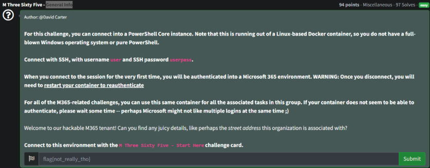
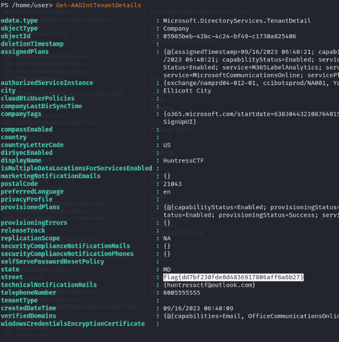
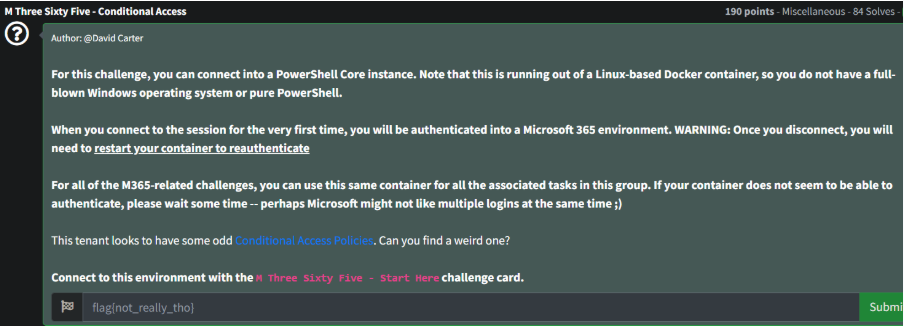
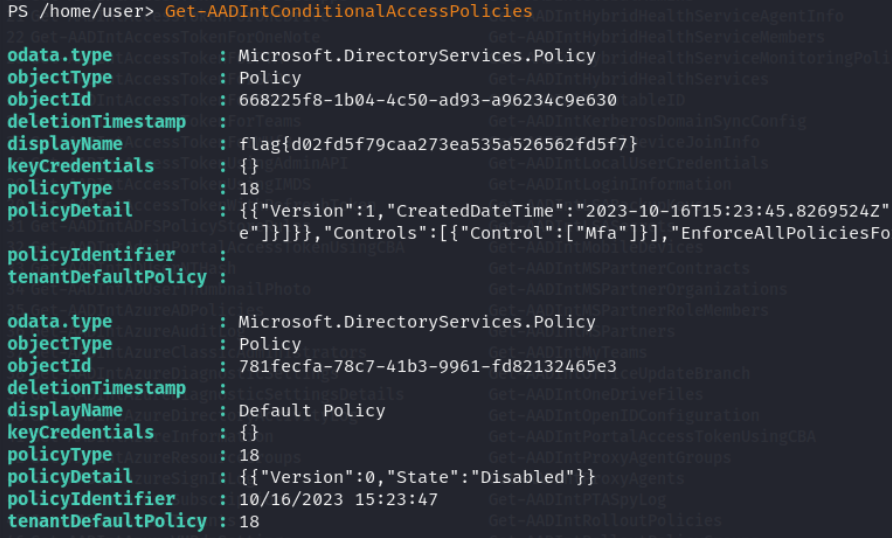
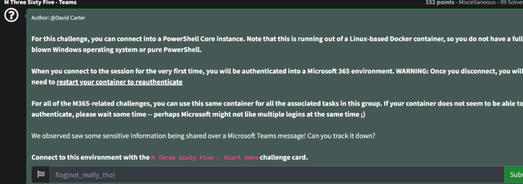
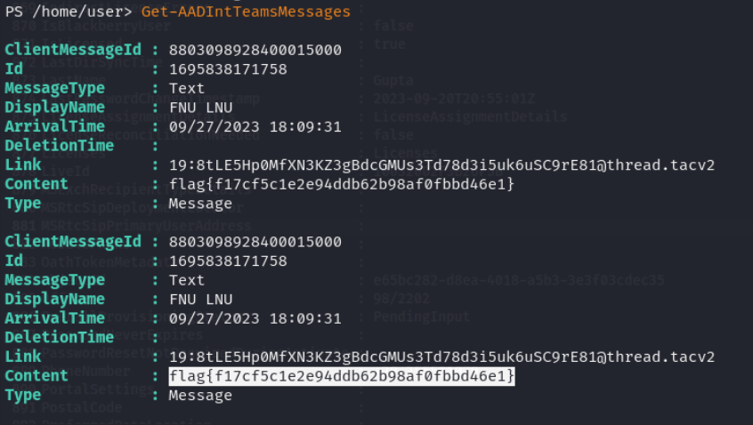
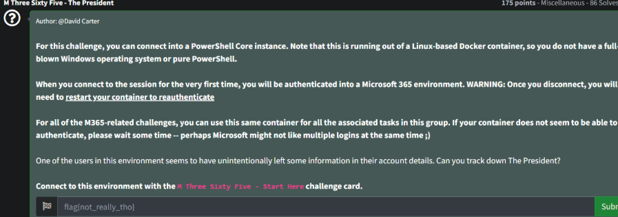
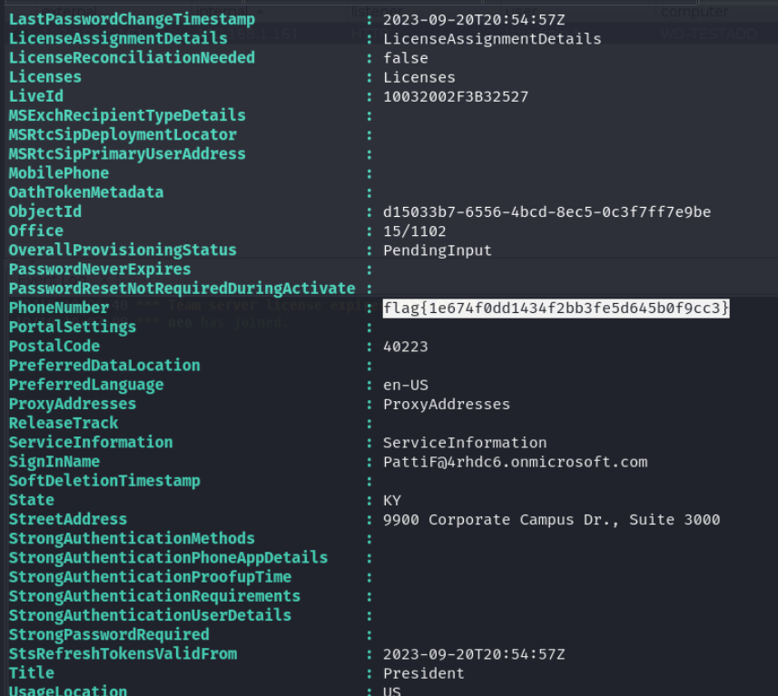

# Prompt

## General Info

- `Get-AADIntTenantDetails`

## Conditional Access

- `Get-AADIntConditionalAccessPolicies`

## Teams

- `Get-AADIntTeamsMessages`

## The President

- `Get-AADIntUsers`

