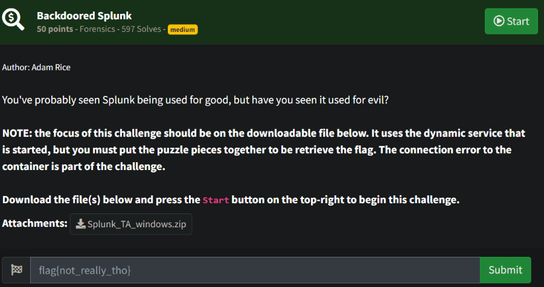
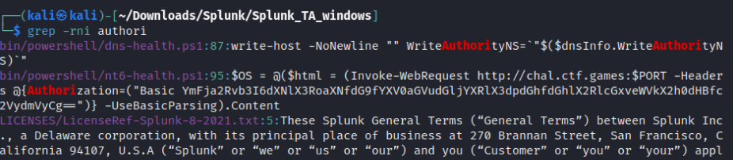
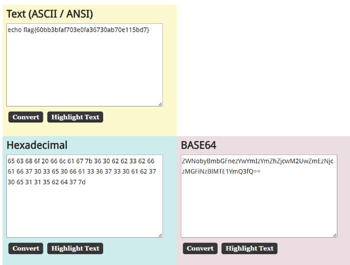

# Prompt

# Solution

- When you navigate to the site provided in the challenge, it says it’s missing the authorization key, so I decided to search through the files for authorization (partial string).

- I found a Powershell script with the authorization string and decided to use that to connect to the site. The site returned a Base64 encoded string which I then decoded to get the flag. 

