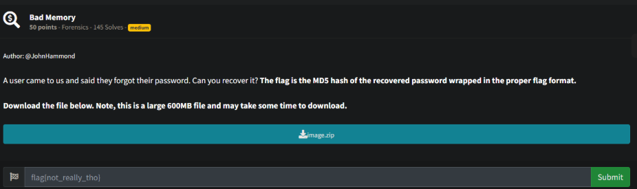
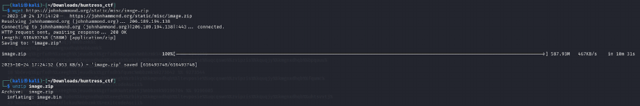
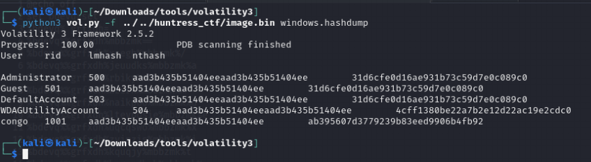
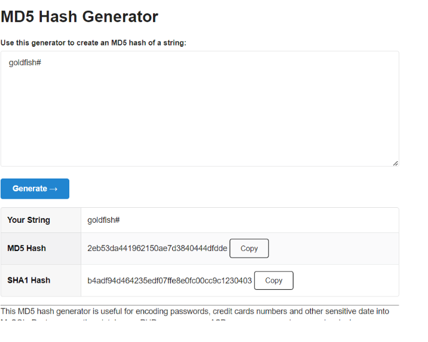

# Prompt

# Solution

- Take the passwords, put them in the proper format, and then use john to crack them with rockyou.txt. The password is goldfish#. Get the md5 hash of the string and voila, you have the flag.

