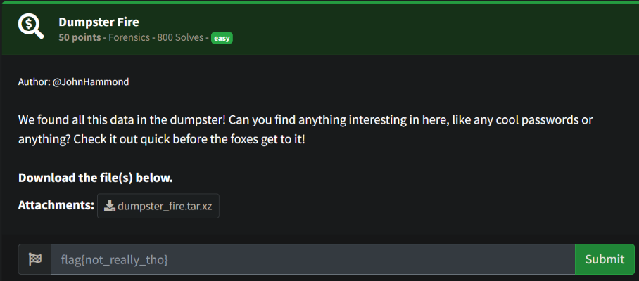
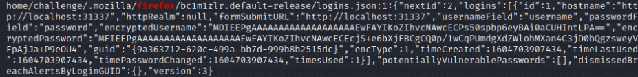
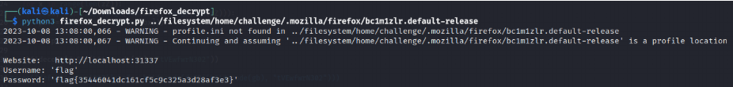

# Prompt



# Solution

- The challenge mentions something about passwords and a fox, so maybe it’s something to do with firefox. The initial grep was just for passwords and that’s where I came across the firefox string. The second grep (below) was added for ease of finding it.

```
grep -rni password | grep firefox
```



- Using the tool: https://github.com/unode/firefox_decrypt, you can find the flag.

