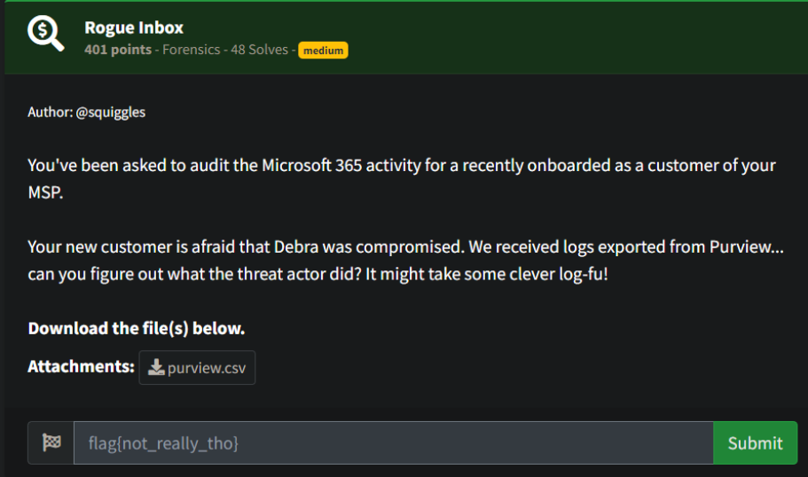
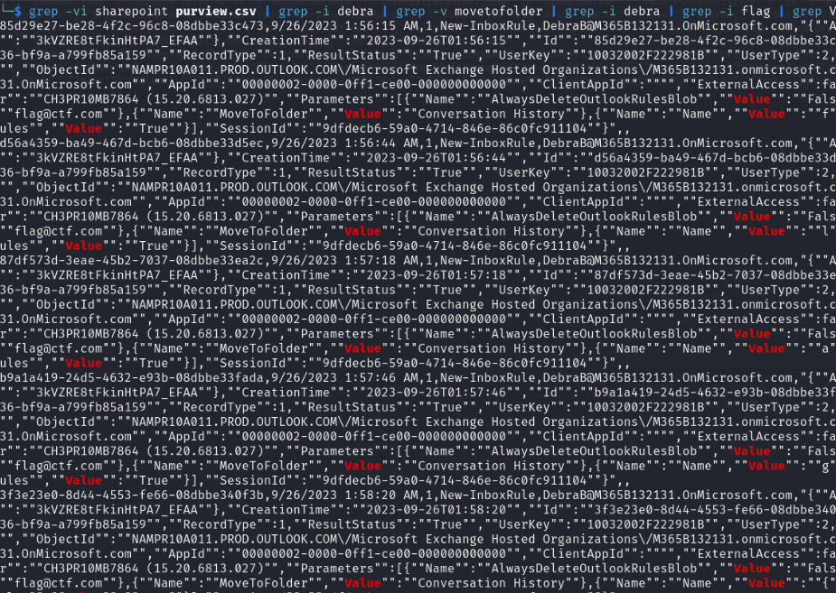
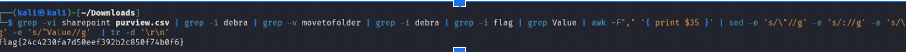

# Prompt



# Solution

- You are presented with a CSV and a hint towards Debra. Searching for Debra, I noticed some flag@ctf.com. I figured that was the correct route, but wasn’t sure while parsing through the data what it was… Eventually, while staring at walls of JSON, I found an ascending “f…l…a…”, so I did some bash fu and found the flag as shown below.  

```
grep -vi sharepoint purview.csv | grep -i debra | grep -v movetofolder | grep -i debra | grep -i flag | grep Value | awk -F"," '{ print $35 }' | sed -e 's/\"//g' -e 's/://g' -e 's/\}$//g' -e 's/^Value//g'  | tr -d '\r\n'
```



- If you look all the way over to the right, you will see the descending f, l, a,g …



flag{24c4230fa7d50eef392b2c850f74b0f6}