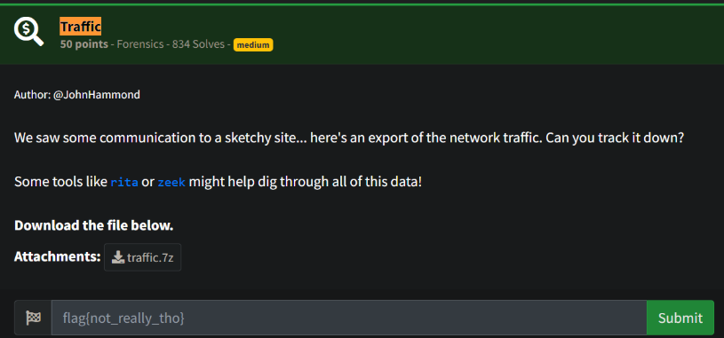
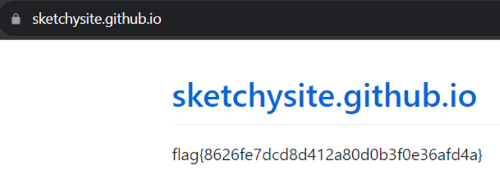

# Prompt



# Solution

- After a long and drawn out installation of Rita on Kali, you have to start MongoDB and run RITA. The challenge calls out a potentially “sketchy site”.

```
7z x traffic.7z
./rita import ../2021-09-08 traffic
rita show-beacons-sni traffic
rita show-beacons-sni traffic | awk -F"," '{ print $3 }' | sort -n
# Output: 
# ... sketchysite.github.io ...
# 0.881,10.24.0.2,sketchysite.github.io,48,5173,248329,0.889,0.987,1,0.648,196
```

