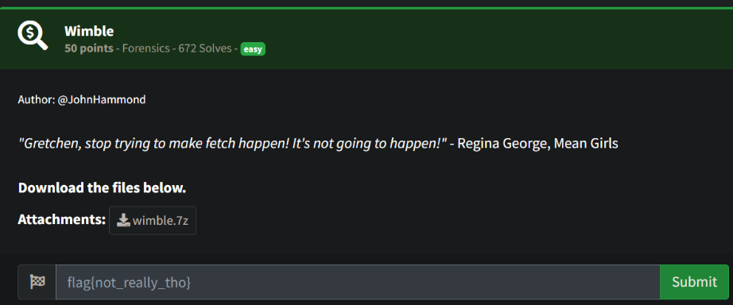
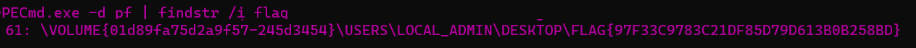

# Prompt

# Solution

- I struggled a little trying to get various tools to work since I didn’t already have them installed. Eventually, I decided to use PECmd.exe and findstr onWindows. The tools I found didn’t work out of the box or easily on Kali/Linux. 

- The archive is a 7z file. You extract that, then extract the fetch XPRESS compressed file and then you have a bunch of Windows Prefetch files. Use a tool like PECmd to search through them and find the flag.

