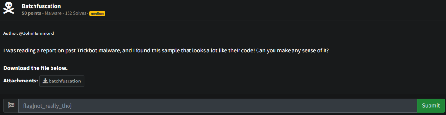
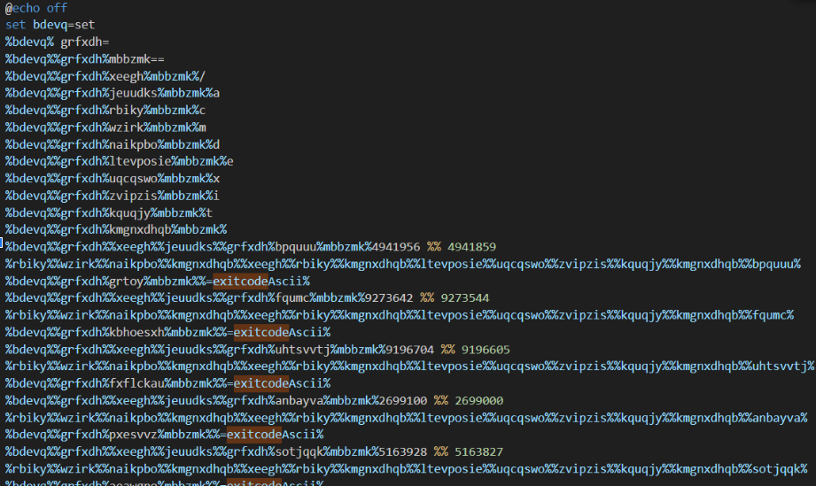
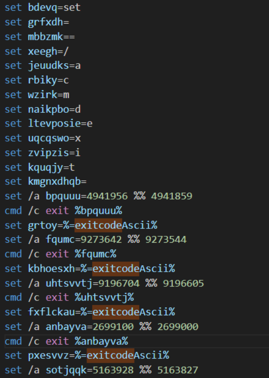
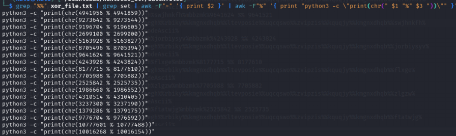
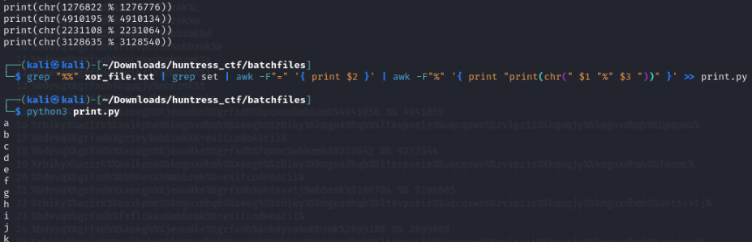
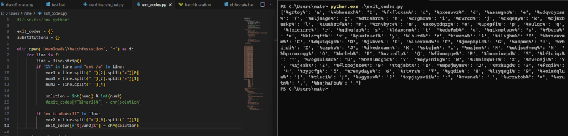
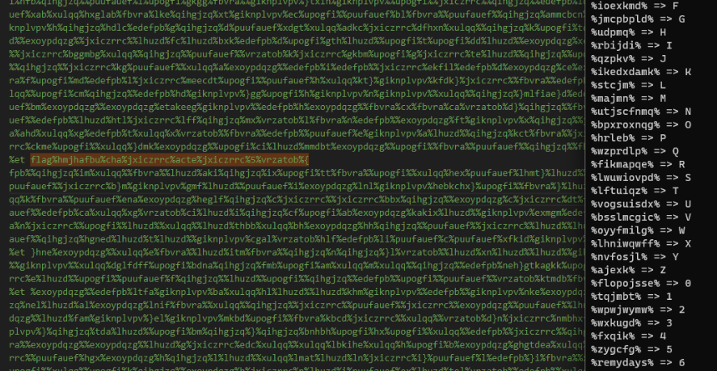
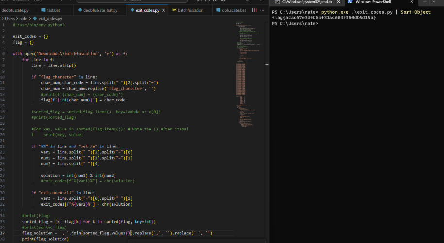

# Prompt



# Solution

- I found this project: https://github.com/DissectMalware/batch_deobfuscator to decode the file, but it’s not 100% accurate. I went through and manually decoded the file which didn’t take too long, though there is mostly junk information in the file. I found this: https://www.huntress.com/blog/tried-and-true-hacker-technique-dos-obfuscation. I did a lot of this manually. It would have been faster to do this programmatically, but I got it. 













- I got the values of the return characters and the corresponding character. This would have been faster to script, but I did it manually. I essentially matched the exitcodeAscii variable to the value and “find and replaced” the characters commonly found in the CTF’s flags (md5 hash, so 0-9 and a-f). I also did the curly braces, underscore, etc. I found the flag_character string and then looped through, parsed those values, and retrieved the flag. 



- Again, this script will work to provide the exit_codes (Add in the print statements) and then you have to do a lot of this manually. After that, you can then use this script to find the flag. 

```python
#!/usr/bin/env python3

exit_codes = {}
flag = {}

with open('Downloads\\batchfuscation', 'r') as f:
    for line in f:
        line = line.strip()

        if "flag_character" in line:
            char_num,char_code = line.split(" ")[2].split("=")
            char_num = char_num.replace('flag_character', '')
            #print(f'{char_num} = {char_code}')
            flag[f'{int(char_num)}'] = char_code

        #sorted_flag = sorted(flag.items(), key=lambda x: x[0])
        #print(sorted_flag)

        #for key, value in sorted(flag.items()): # Note the () after items!
        #    print(key, value)

        if "%%" in line and "set /a" in line:
            var1 = line.split(" ")[2].split("=")[0]
            num1 = line.split(" ")[2].split("=")[1]
            num2 = line.split(" ")[4]

            solution = int(num1) % int(num2)
            #exit_codes[f"%{var1}%"] = chr(solution)

        if "exitcodeAscii" in line:
            var2 = line.split("=")[0].split(" ")[1]
            exit_codes[f"%{var2}%"] = chr(solution)

    #print(flag)
    sorted_flag = {k: flag[k] for k in sorted(flag, key=int)}
    #print(sorted_flag)
    flag_solution = ', '.join(sorted_flag.values()).replace(',', '').replace(' ', '')
    print(flag_solution)
```