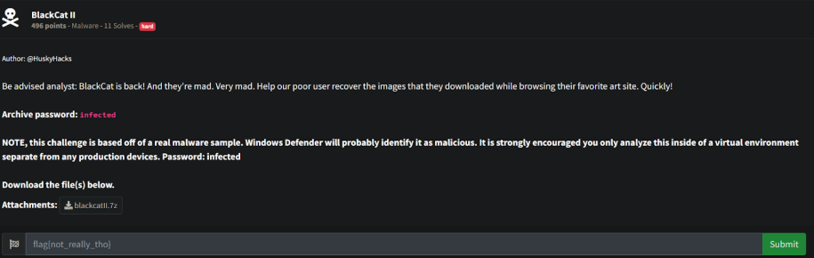
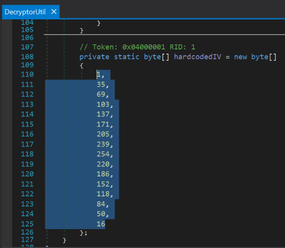
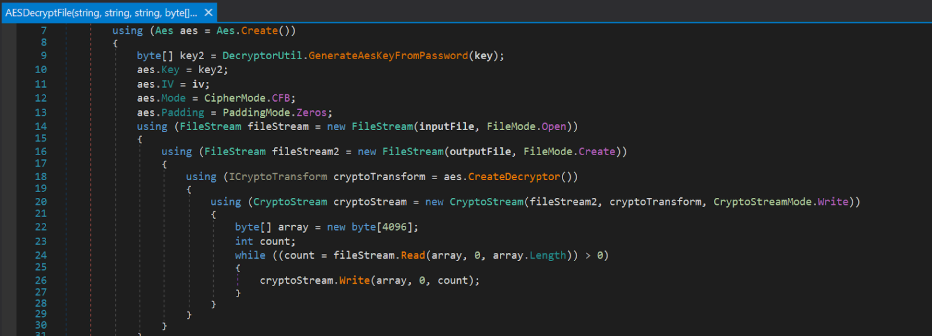
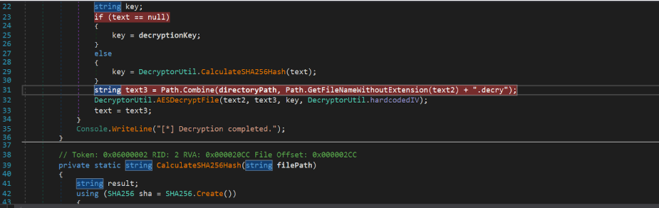
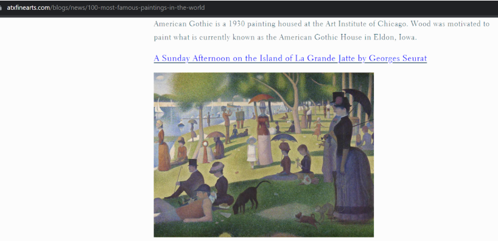
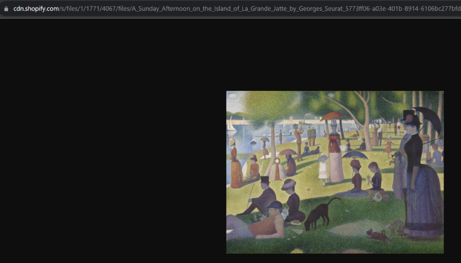
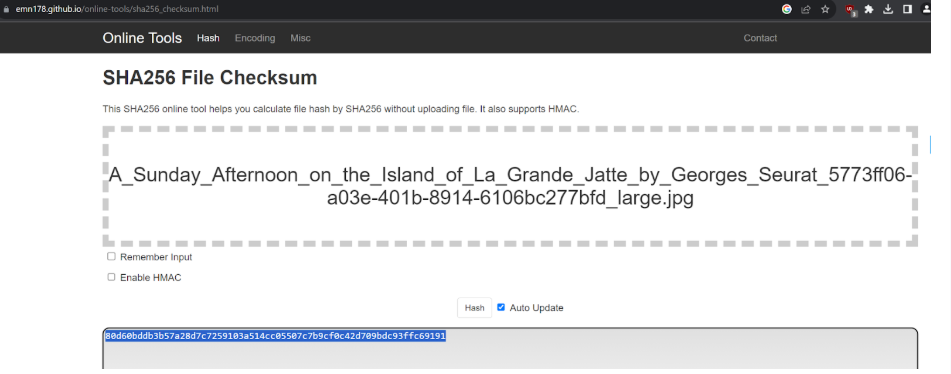
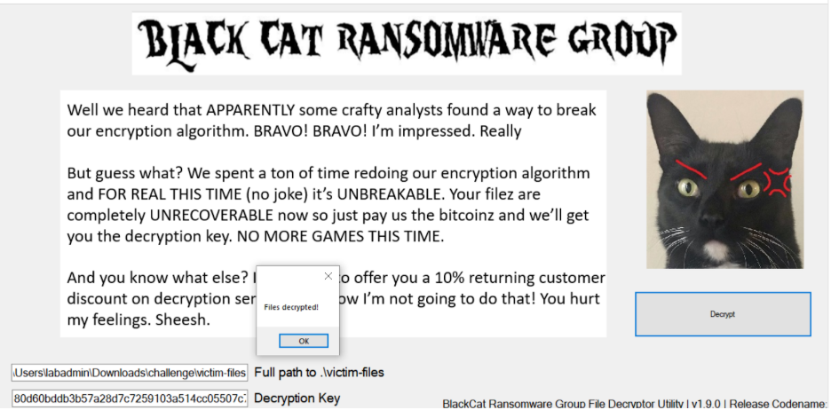
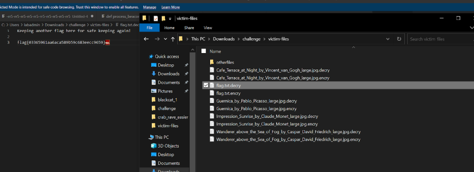

# Prompt

# Solution

- It seems like you need to decrypt the first file with the correct key, then it uses the sha256 hash of the decrypted file for the next file. This process repeats until all files are processed and decrypted. You have to find the original file and grab the hash from it. I found a link on Google which lead me to the image: 

- `hxxps://cdn[.]shopify[.]com/s/files/1/1771/4067/files/A_Sunday_Afternoon_on_the_Island_of_La_Grande_Jatte_by_Georges_Seurat_5773ff06-a03e-401b-8914-6106bc277bfd_large.jpg?v=1571687486`

- Download the image from this site. Notice the filename is the same. Get the sha256 hash of this file and then enter it into the program.

