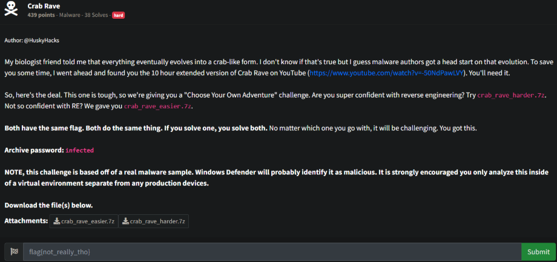
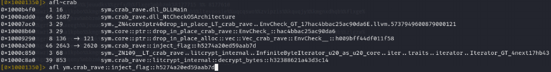
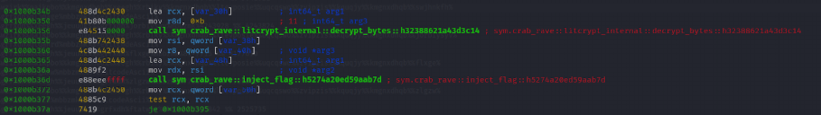
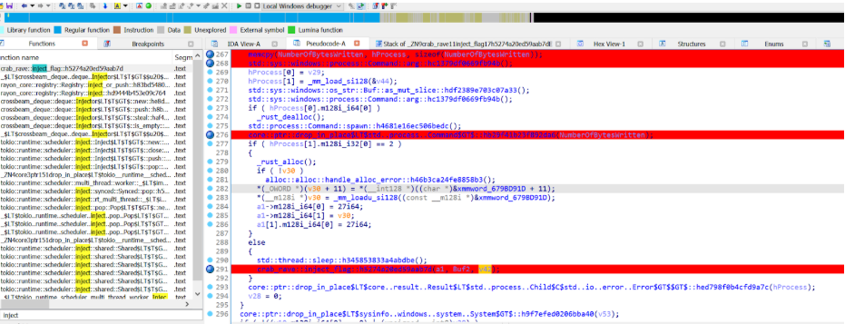
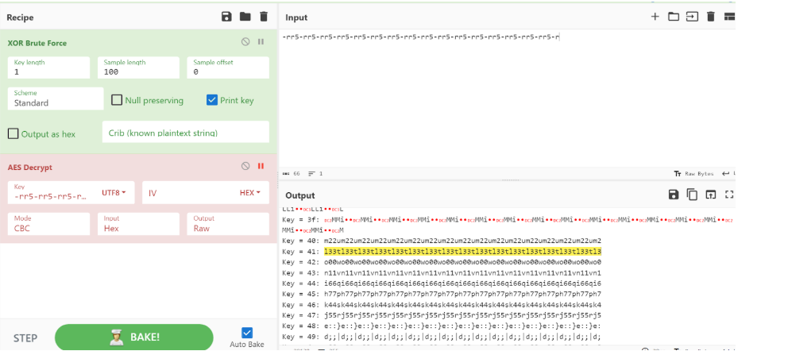
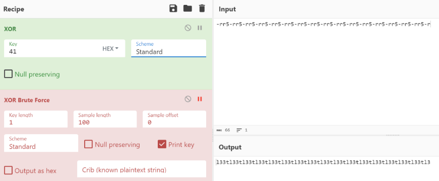
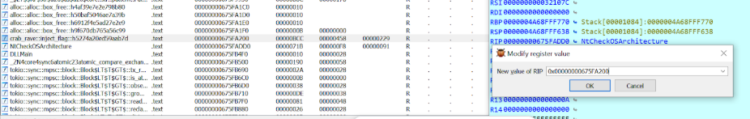
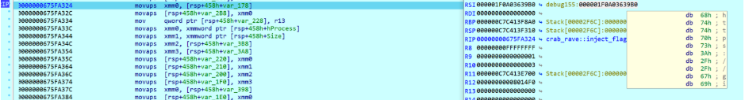
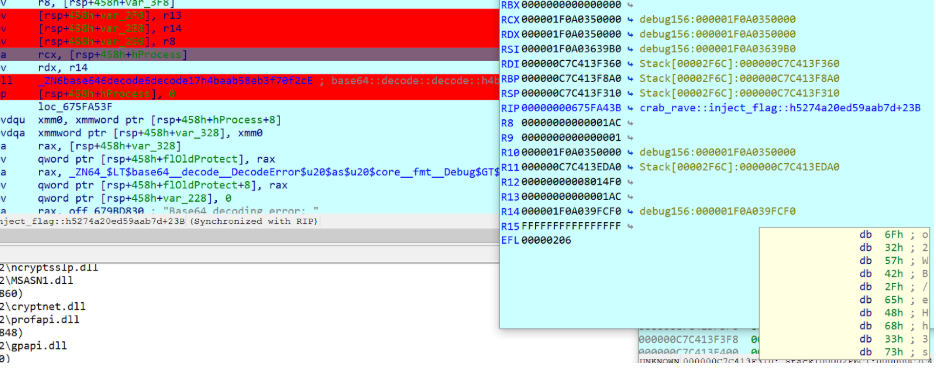
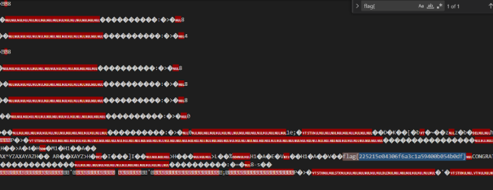

# Prompt



# Solution











- Set RIP to inject_flag function



- Proceed through the code until you get to the request portion where it is reaching out and grabbing a base64 encoded string from a [gist link](
https://gist.githubusercontent.com/HuskyHacks/8cece878fde615ef8770059d88211b2e/raw/abcaf5920a40843851eec550d1dca97e9444ac75/gistfile1.txt
). 



")

- Pulls the base64 from that git link (o2wB/ is the start of the base64 from the gist link above).



```
o2WB/eHh3s+SxgR4QUjE9f0yAt4C16oHZvaclKlmBo4K1bsVSbVS2fjxjao/YVUGv7v7Om5xkDjXxARjF6AZalN6pENSgVBQIrYfMq+VeBwwR1whFWRGIC+qulG6HDYmfZt6Va4iljyljxbSnZMrxQwWUXJDhEju2iVzsa1l6nFzoHWO+5+pDV8+sLn3P9jhfZE7qLKVOt7Lm/stSBWZDgzuvqpZziBYo5EumdrISYvWkMm5T2ZD7iRSQaJ3Hr9LUd0nOnfVLW2CyLNmqAM/BKc0f5A9YAoGISmymjc+camULpCiS4WoI8CiyBKOXr5K3CQgx0O9nOn8aS2IU7RreOopH08EGON6DBzkIwbqpC9o28A+wNZsc6cJC0AplIUAafdONBlg/NmcSmkOnPOAR/qhMGMlZKtzEqi4RZDzOfo=
```

- I remember running through this and finding potential base64 strings that could be the key or IV or pieces of those that had to do something with the challenge.
  - `bcArWWUUqlFNurbMIOYiVyAs7SHQvro8e[`
  - `XbcArWWUUqlFNurbM`

- What I ended up doing is dumping the memory of the process and finding the decrypted flag in memory.
  - `procdump.exe -ma 2692`



flag{225215e04306f6a3c1a59400b054b0df}