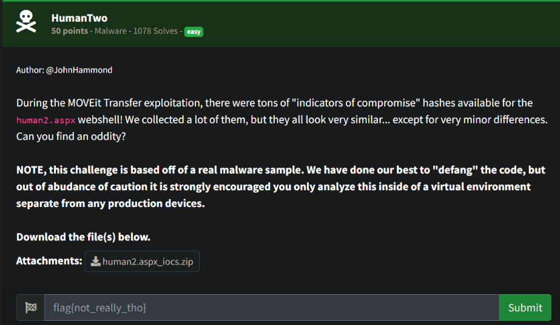
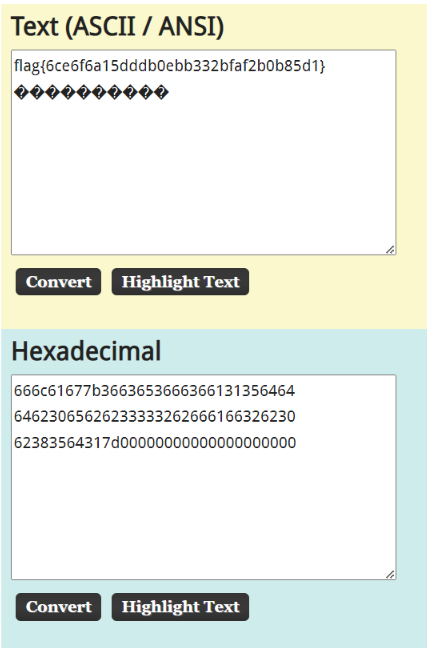

# Prompt



# Solution

- I unzipped the file and did a recursive diff:

```
for f in $(ls); do echo "${f}" >> iocs2.txt; diff 00016e6f4c0dbf5c88f630f53821f086363606c274832568b50c11d04ad044f9 "${f}" >> iocs2.txt; done;
```

- Found this diff in iocs2.txt

```
if (!String.Equals(pass, "666c6167-7b36-6365-3666-366131356464"+"64623065-6262-3333-3262-666166326230"+"62383564-317d-0000-0000-000000000000")) {
```

- Removed the ‘-’ (hex) and concat the strings to get the flag

