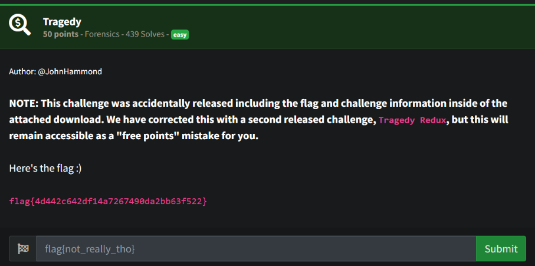
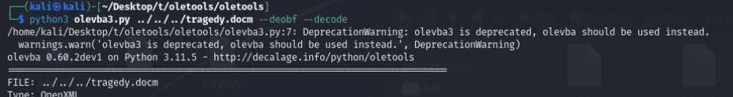
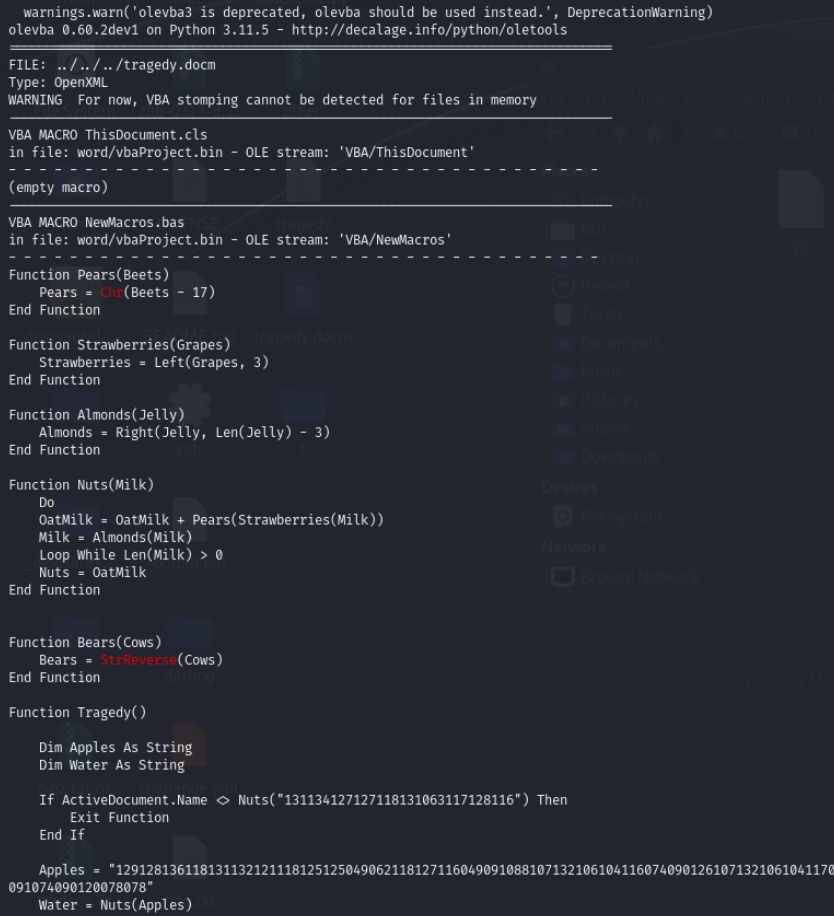
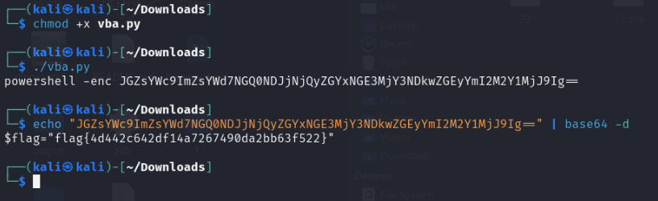

# Prompt



# Solution

- I solved it, but they took it down :( Then, they gave it as a freebee to everyone.

- It’s a 7z containing a zip and a .docm file. It has a malicious macro in it. You can use OLE Tools to look at the macro. 





- Converting the function to Python yields this code:

```python
#!/usr/bin/env python3

def Pears(Beets):
    return chr(int(Beets) - 17)

def Strawberries(Grapes):
    return Grapes[:3]

def Almonds(Jelly):
    return Jelly[3:]

def Nuts(Milk):
    OatMilk = ''
    while Milk:
        OatMilk += Pears(Strawberries(Milk))
        Milk = Almonds(Milk)
    return OatMilk

Apples = "129128136118131132121118125125049062118127116049091088107132106104116074090126107132106104117072095088098065095085091123095123098138107088106137095088086068094123106068095085124136107088086138106126090067094067106066094123091074090120078078"

Water = Nuts(Apples)
print(Water)
```

