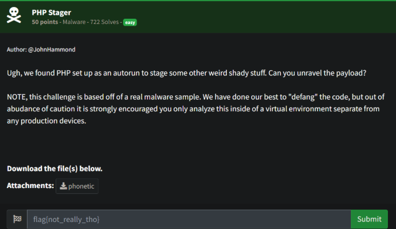
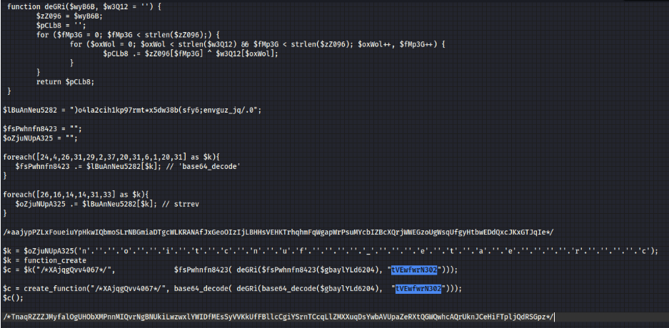
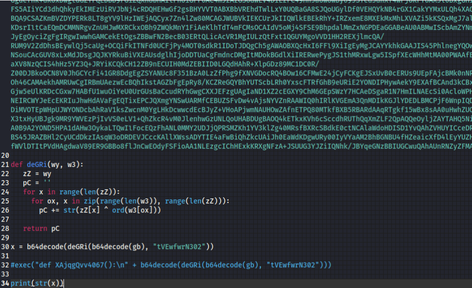
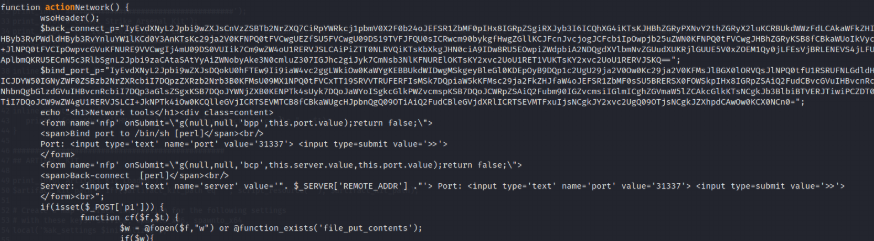
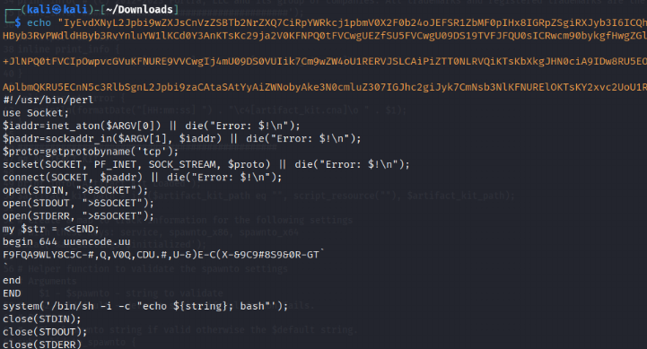
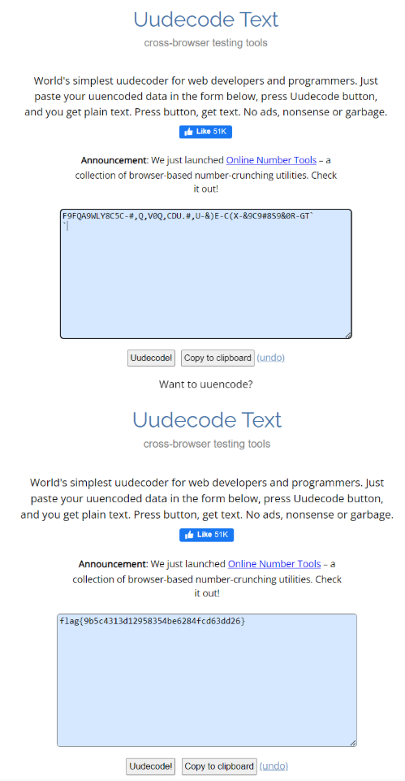

# Prompt



# Solution

- I started manually analyzing the code and made some strides, but then I did some digging and found a write up of pretty much this same challenge here: https://sudoshreyansh.medium.com/phonetic-writeup-h-ctivitycon-2021-52f335ad1d90. The flag value and challenge were exactly the same, I guess that’s why it was “easy” lol. UPDATED: I did go back through and decode the code more and it was relatively easy once I used PHP and not Python which I messed up, lol.





- So playing with the code itself more, you can run `php decode.php >> decoded.php`. The abbreviate code is below:

```php
<?php 
// decode.php 
function deGRi($wyB6B, $w3Q12 = '') { $zZ096 = $wyB6B; $pCLb8 = ''; for ($fMp3G = 0; $fMp3G < strlen($zZ096);) { for ($oxWol = 0; $oxWol < strlen($w3Q12) && $fMp3G < strlen($zZ096); $oxWol++, $fMp3G++) { $pCLb8 .= $zZ096[$fMp3G] ^ $w3Q12[$oxWol]; } } return $pCLb8; }

$gbaylYLd6204 = "LmQ9AT8aND16c2Ac….B9A2t4";

$c = base64_decode( deGRi(base64_decode($gbaylYLd6204), "tVEwfwrN302"));
echo $c;
?>
```

- There is a lot of output here, but there is the actionNetwork function that has 2 Base64 encoded strings in it. This outputs the following (partial) output:



- Decoding the first base64 string above results in the below: 



- You can take the uuencoded string and decode it online via a number of sites:

