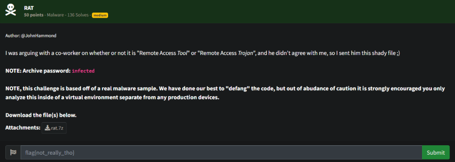
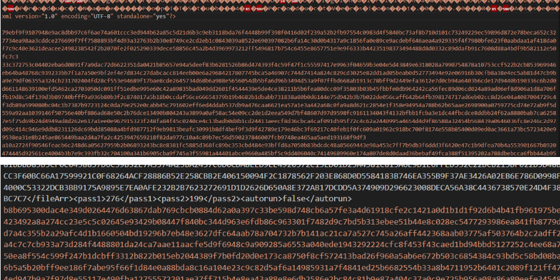
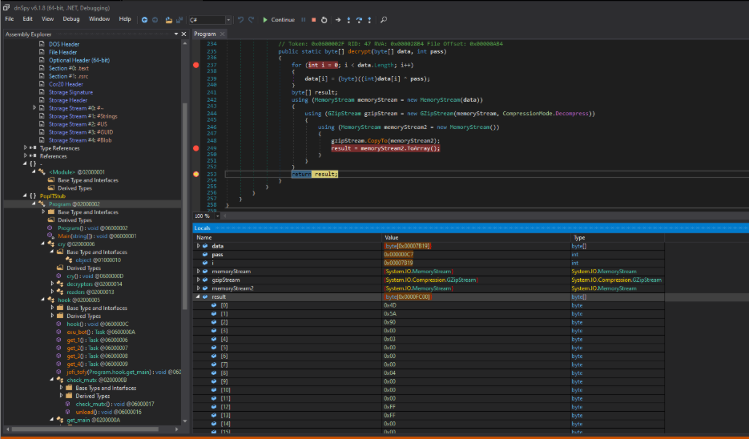
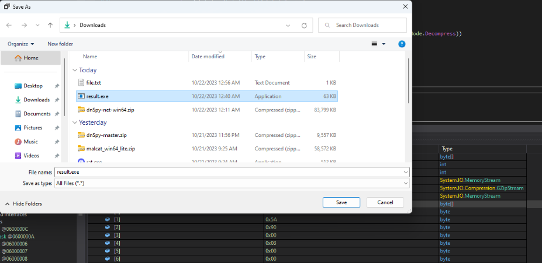
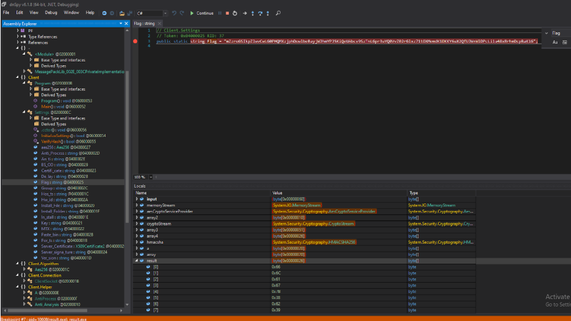
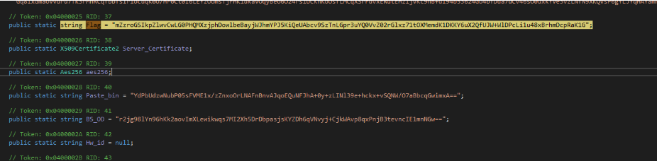
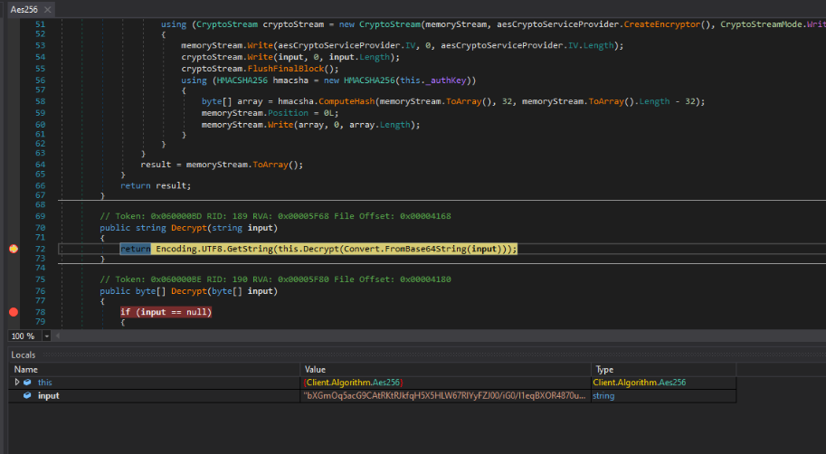
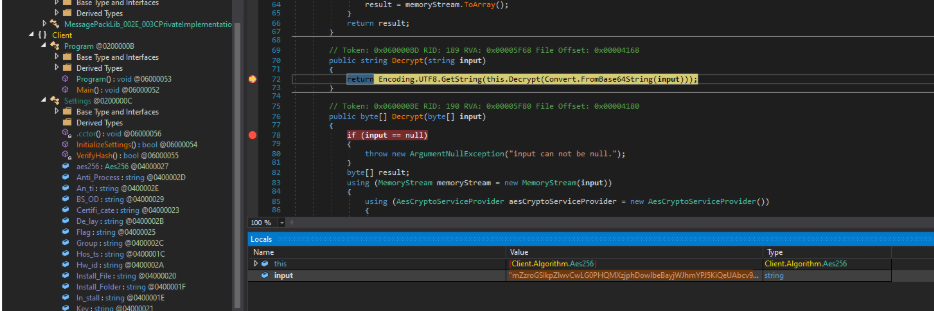
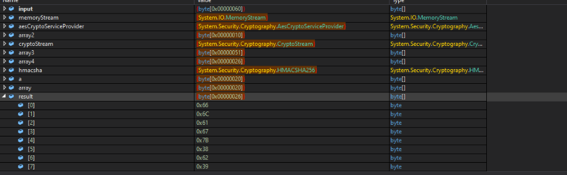
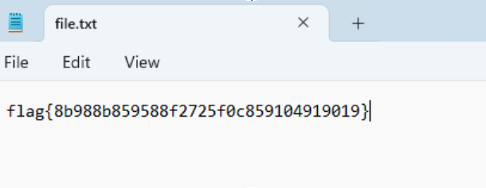

# Prompt

# Solution

- dnSpy is a good tool for this one. Essentially, I loaded the rat and added some breakpoints. Eventually, I found where the extra lines in the binary (below) are loaded. I saved the file as a new executable and started analyzing it.

- The lines are a massive sting that is decoded several times into the executable bytes. You can right-click and save the “result” bytes to a new file. 

- When you open up the new file in dnSpy, you will find the program, some additional decryption, and a Flag parameter that is base64 encoded, but encrypted. 

- I added in some breakpoints. When I got to a breakpoint in the decryption process, the first time the debugger ran, it loaded in a couple of strings and then exited. The next time it ran, I modified the value to decrypt the Flag.

- Save the file and open it to get the flag.

