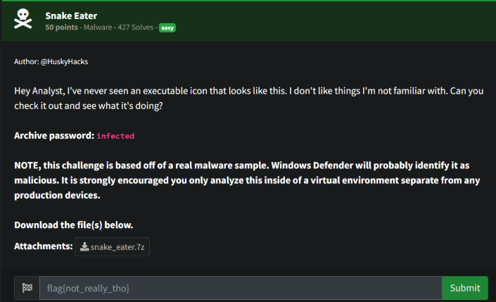
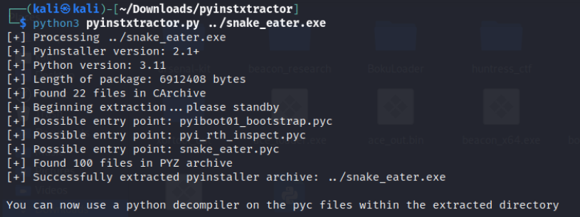
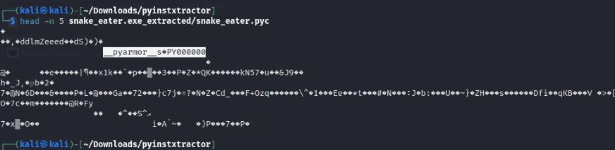
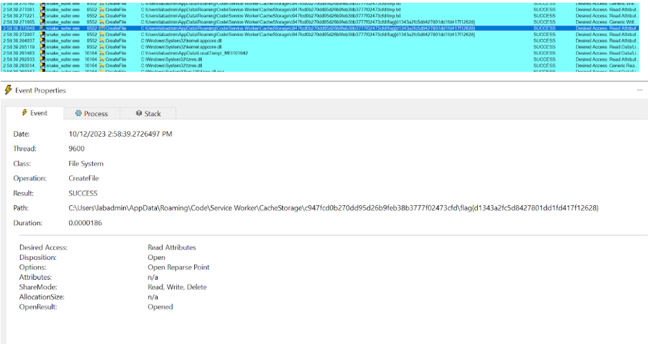

# Prompt

# Solution

- If you look at the icon, it is very clearly a PyInstaller executable which means it was created with Python. Plus the challenge name, “Snake” Eater => Python. So we can use PyInstXtractor https://github.com/extremecoders-re/pyinstxtractor. 

- We see snake_eater.pyc (compile Python file, so let’s look at it)

- Looks to be obfuscated with PyArmor: https://github.com/dashingsoft/pyarmor. Well, after a loooong time of trying to decompile the pyc file and get any one of the few PyArmor tools working, I started looking at memory dumps using Process Explorer, Process Dump, Process Hacker, etc. I forgot about ProcMon (Process Monitor). Executing the snake_eater.exe file with ProcMon running, you can dig through what all the executable is doing. After some exploring, you’ll find a CreateFile Method being called:

