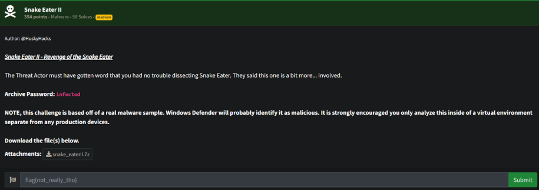
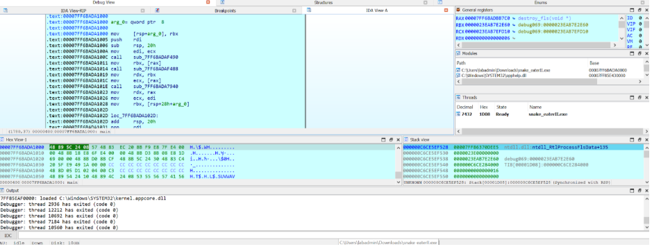
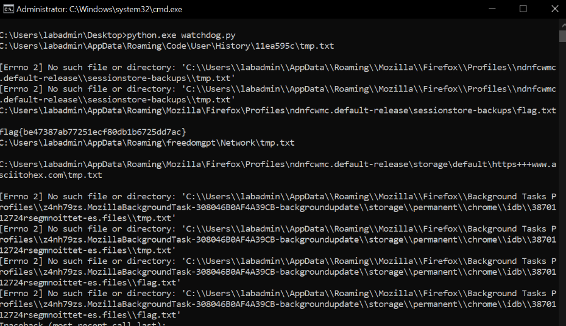

# Prompt



# Solution

- So this one is a little more complex than the other one. I used ProcMon to determine that the program was writing a file randomly in AppData/Roaming, but deleted it after writing before it could be read. I ultimately used IDA to break on fwrite and single stepped through in conjunction with a Python watchdog script to watch for file writes. 




```python
import os
import shutil
import win32file
import win32con

dest_path = "C:\\Users\\labadmin\\Desktop\\flag.txt"

ACTIONS = {
    1: "Created",
    2: "Deleted",
    3: "Updated",
    4: "Renamed from something",
    5: "Renamed to something"
}
FILE_LIST_DIRECTORY = 0x0001

path_to_watch = "C:\\Users\\labadmin\\AppData\\Roaming"
hDir = win32file.CreateFile(
    path_to_watch,
    FILE_LIST_DIRECTORY,
    win32con.FILE_SHARE_READ | win32con.FILE_SHARE_WRITE | win32con.FILE_SHARE_DELETE,
    None,
    win32con.OPEN_EXISTING,
    win32con.FILE_FLAG_BACKUP_SEMANTICS,
    None
)
while 1:
    results = win32file.ReadDirectoryChangesW(
        hDir,
        1024,
        True,
        win32con.FILE_NOTIFY_CHANGE_FILE_NAME |
        win32con.FILE_NOTIFY_CHANGE_DIR_NAME ,
        None,
        None
    )
    for action, file in results:
        full_filename = os.path.join(path_to_watch, file)
        try:
            source = open(full_filename, 'r')
            line = source.readline()
            print(full_filename)
            print(line)
            continue
        except FileNotFoundError as e:
            print(e)
            continue
```

