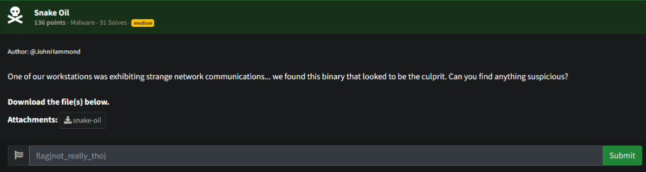
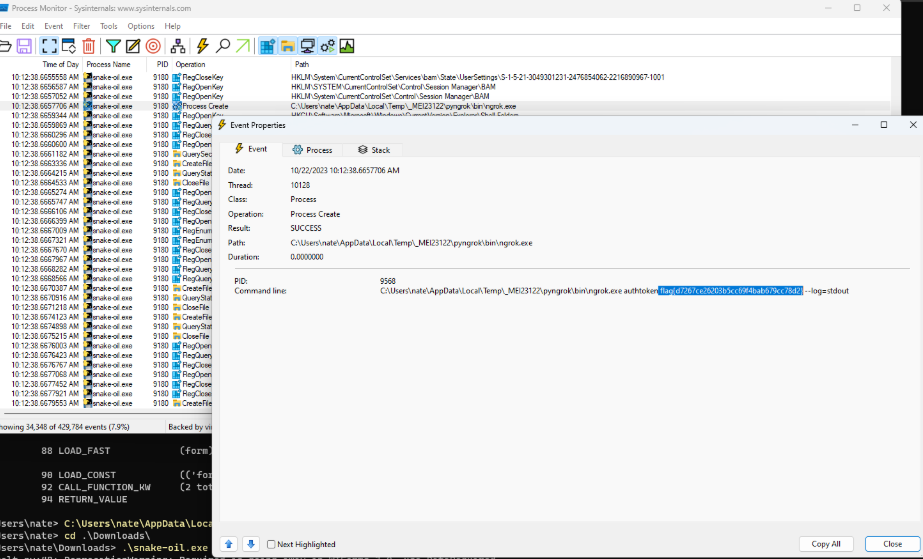

# Prompt

# Solution

- This is another PyInstaller generated executable. I started down the path of using PyInstXtractor to pull out the code and then decompiling the pyc, but that didn’t get me too far. I decided to run the executable and check Process Monitor. You can easily Filter for snake-oil.exe and then search for “flag{“. 

