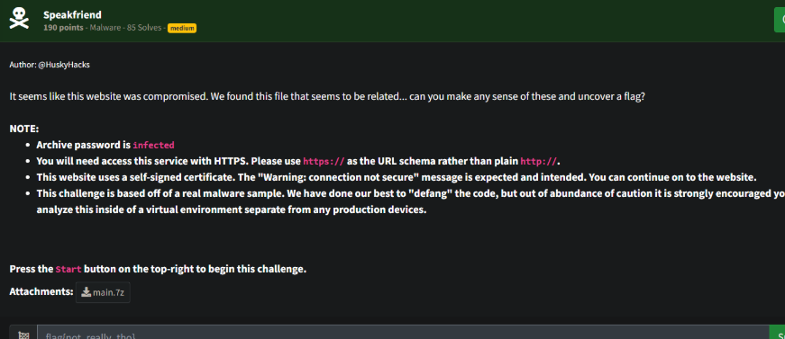
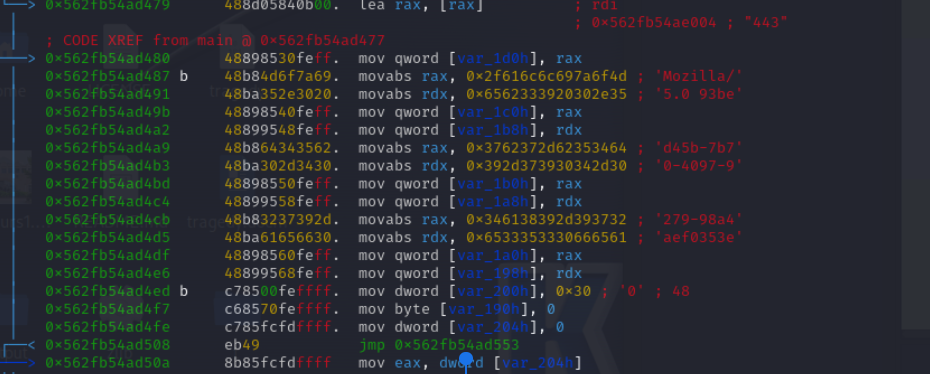

# Prompt



# Solution

- I was not smart with this one. I would have solved this so much faster if I read. I totally missed starting the service and using the CTF Challenge. The binary spit out different IPs, so I was trying to connect to who knows what... Major facepalm... After several hours of having the dumb and connecting random sites on the Internet, I went back and looked at the challenge and saw my error. I would have finished this sooo long ago. 

- You analyze the binary and find a User Agent (Speak Friend - LOTR reference), so the User Agent string makes sense given the clues. When you use the correct UA string, it provides a redirect and then the flag. I used Radare2 to find the UA string. 

```
7z x main.7z
chmod +x main
r2 ./main
aaaa
afl
pdf @main 
```



