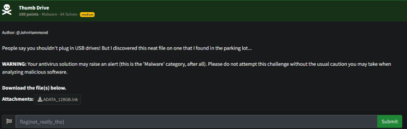
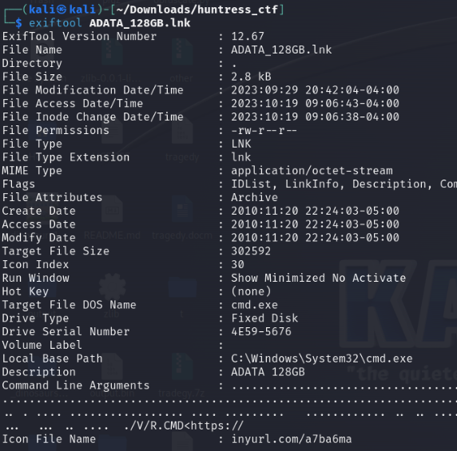
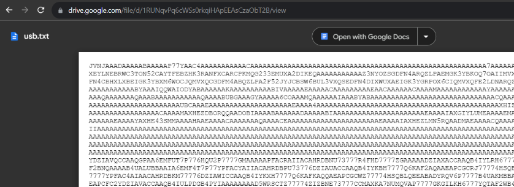
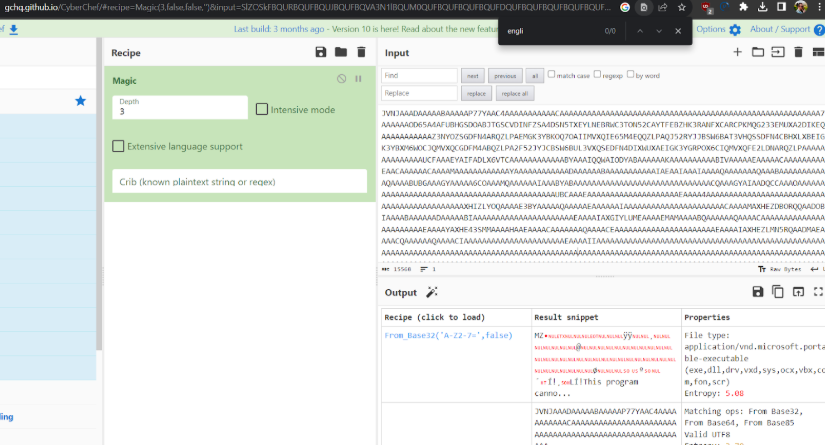
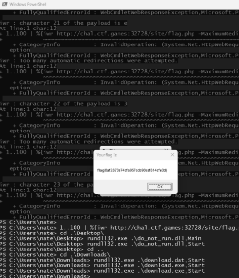

# Prompt

# Solution

- Download the file and analyze it with strings or exiftool. This will present a TinyURL link that leads to a usb.txt file hosted on Google Drive.

- At a first look, it looks like Base64, but a little off. So if you use CyberChef’s Magic, you can find that it’s an exe/dll. 

- The file is actually a DLL. Download this file and execute it: rundll32.exe download.dll,Start to retrieve the flag

