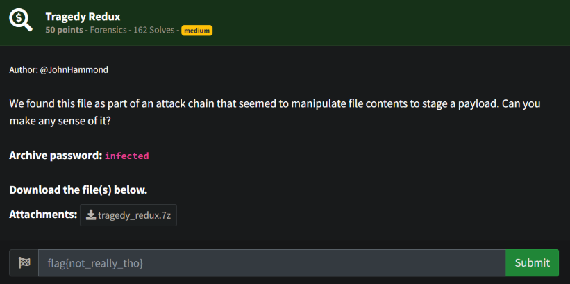
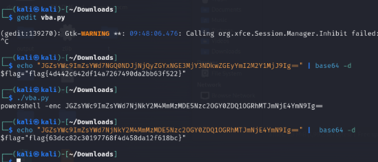

# Prompt



# Solution

- Same thing as the [Tragedy](/huntress_2023/Malware/Original_Tragedy-Easy/Solution.md) challenge, except the large int/decimal string is slightly different. I was like number 2 or 3, I think, to solve it. It took me an extra second to change the large sting input and then I resubmitted the original flag - /doh!

```python
#!/usr/bin/env python3

def Pears(Beets):
    return chr(int(Beets) - 17)

def Strawberries(Grapes):
    return Grapes[:3]

def Almonds(Jelly):
    return Jelly[3:]

def Nuts(Milk):
    OatMilk = ''
    while Milk:
        OatMilk += Pears(Strawberries(Milk))
        Milk = Almonds(Milk)
    return OatMilk

Apples = "129128136118131132121118125125049062118127116049091088107132106104116074090126107132106104117072095123095124106067094069094126094139094085086070095139116067096088106065107085098066096088099121094101091126095123086069106126095074090120078078"

Water = Nuts(Apples)
print(Water)
```

