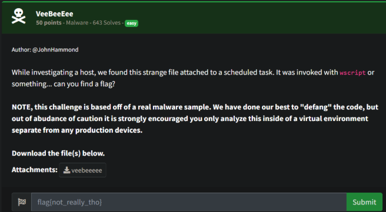
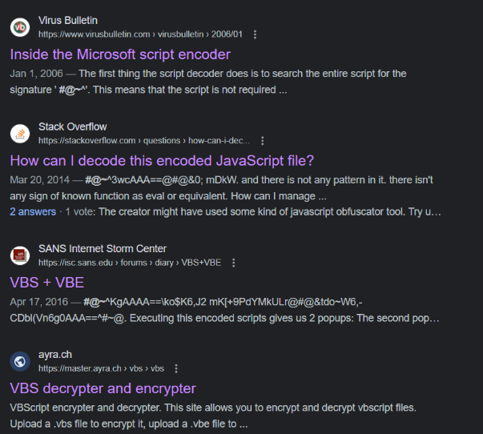
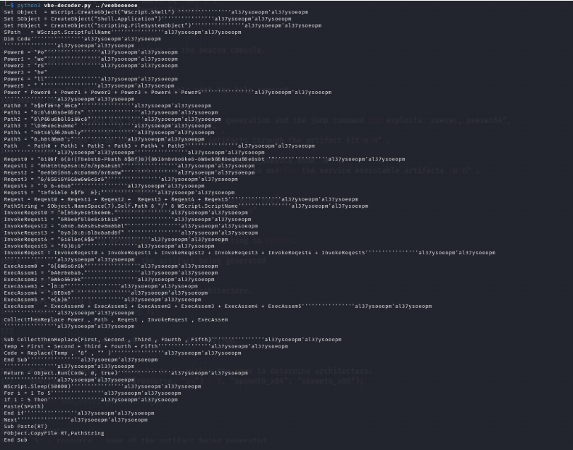
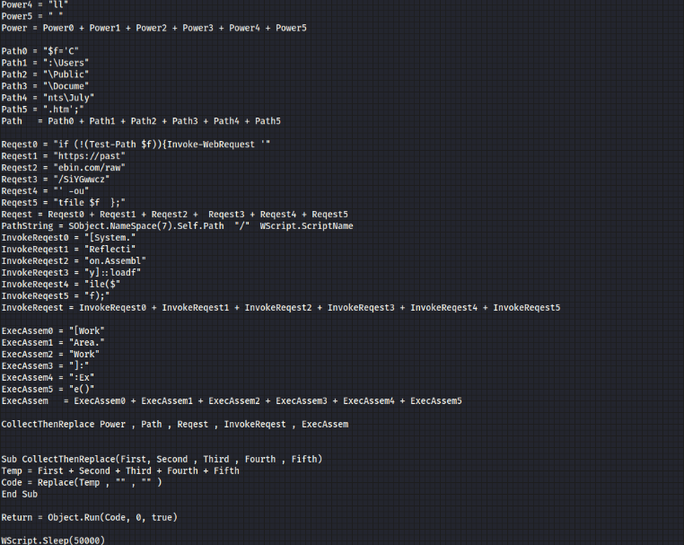
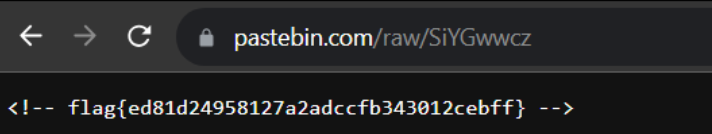

# Prompt

# Solution

- So I wasn’t sure what this was at first since it has been a really long time. But I did a search for the start string of the file: `‘#@~^’` since it looked familiar.

Then, I used this script (https://github.com/JohnHammond/vbe-decoder)  to decode the vbscript. 

-When you remove all of the junk characters and whatnot, you get the following: 

- You can see the Web Request to a Pastebin link. Go to that link and obtain the flag.

