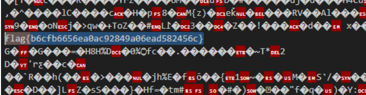

# Prompt


# Solution

- I tried decoding the base64 and had AI translate C# to Python for testing. The code was assembly and unreadable. I tried analyzing the shellcode by building a binary and then analyzing that binary. Ultimately, the solution was to run the program in Powershell, dump the process memory, and search the memory dump for the flag. The code below is what I cleaned up and abbreviated. I also renamed the class, namespace, and made them public. 

```Powershell
$code = @”
using System; using System.Collections.Generic; 
using System.Text;using System.IO; 
using System.Reflection; 
using System.Linq;

namespace H { 
	public class w { 
		private static string zcfZIEShfvKnnsZ(string t, string k) {
			string bnugMUJGJayaT = "abcdefghijklmnopqrstuvwxyzABCDEFGHIJKLMNOPQRSTUVWXYZ";
			string WgUWdaUGBFwgN = ""; 
			Dictionary<char, char> OrnBLfjI = new Dictionary<char, char>();
			
			for (int i = 0; i < bnugMUJGJayaT.Length; ++i) { 
				OrnBLfjI.Add(k[i], bnugMUJGJayaT[i]); 
			}
			
			for (int i = 0; i < t.Length; ++i) { 
				if ((t[i] >= 'A' && t[i] <= 'Z') || (t[i] >= 'a' && t[i] <= 'z')) { 
					WgUWdaUGBFwgN += OrnBLfjI[t[i]];
				} else { 
					WgUWdaUGBFwgN += t[i]; 
				}
			}
return WgUWdaUGBFwgN; 
		}

		public static void Main() {
string pTIxJTjYJE = "CvsjeemeeeeXeeee//…..+bjcxyhexyhe8I3EqwGvqw3ZqUzDilGUMQLvuUGm+bjcxyhexdh9tUJK1wNq0YC4Khfexdh90wuvtSXqkUN8+bjc8I2ztw2vnrNT5dxeeeeeeeeeeeeeeeeeeeeeeeeeeeeeeeeeeeeeeeeeeeeeeeeeeeeeeeeeeeeeeeeeeeeeeeeeeeeeeeeeeeeeeeeeeeeeeeeee";
string YKyumnAOcgLjvK = "lQwSYRxgfBHqNucMsVonkpaTiteDhbXzLPyEWImKAdjZFCOvJGrU";
Assembly smlpjtpFegEH = Assembly.Load(Convert.FromBase64String(zcfZIEShfvKnnsZ(pTIxJTjYJE, YKyumnAOcgLjvK)));
MethodInfo nxLTRAWINyst = smlpjtpFegEH.EntryPoint;
nxLTRAWINyst.Invoke(smlpjtpFegEH.CreateInstance(nxLTRAWINyst.Name), null);
        }
    }
}

“@

Add-Type -TypeDefinition $code -Language CSharp
iex "[H.W]::Main()"
```

- While running, dump the process using process explorer or the built-in Windows Task Manager.

- Analyze the dump to get the flag: 

