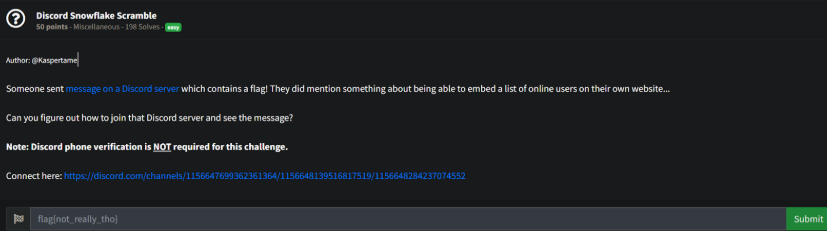
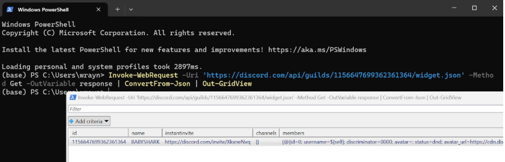
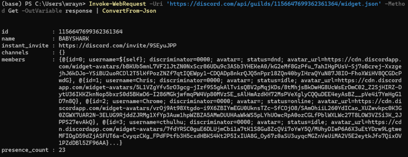
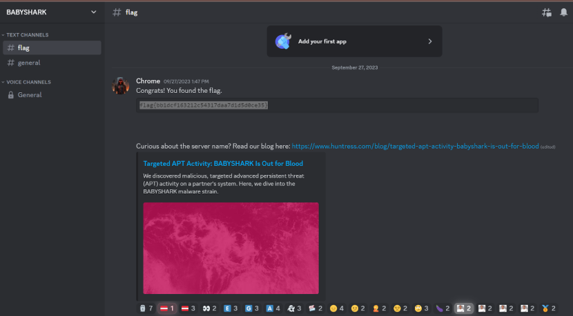

# Prompt

# Solution

- So, if we look at the API for Discord, there is a way to potentially find the invite link to the Discord server:
  - https://discord.com/developers/docs/resources/invite
  - https://www.online-tech-tips.com/web-site-tips/how-to-add-a-discord-widget-to-your-website/

- `Invoke-WebRequest -Uri 'https://discord.com/api/guilds/1156647699362361364/widget.json' -Method Get -OutVariable response | ConvertFrom-Json | Out-GridView`
- `Invoke-WebRequest -Uri 'https://discord.com/api/guilds/1156647699362361364/widget.json' -Method Get -OutVariable response | ConvertFrom-Json`

- Use the found invite link and join the server:

flag{bb1dcf163212c54317daa7d1d5d0ce35}