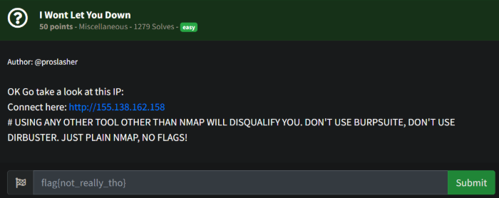
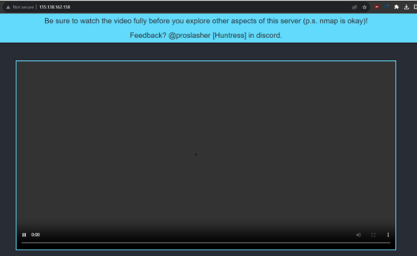
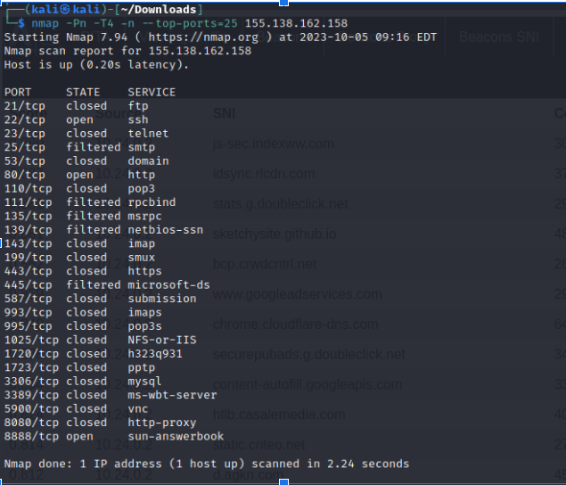
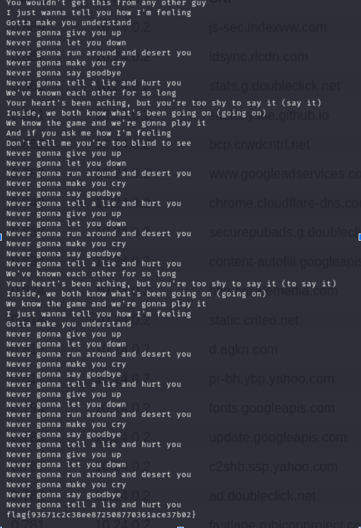

# Prompt

# Solution

- You are presented with this website:

- It mentions nmap (the video not playing, I think, is part of the rickroll…). So we nmap and get the following open ports.

- Port 8888 is open, tried in the browser, but it did not load. So I decided to nc that port in case something else is running. It was - the flag is located at the bottom of the output.

