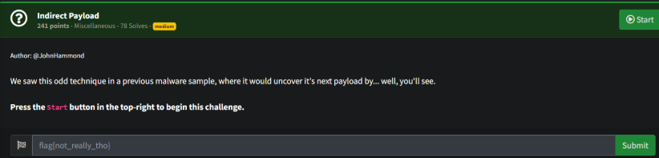
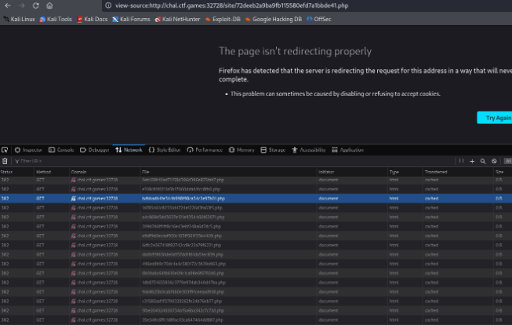

# Prompt

# Solution

- You are presented with a website that, when you press ‘Retrieve the Payload’, it redirects you a bunch of times. I tried with curl/wget, but they never seemed to be able to obtain the payload in response headers.

- Use Invoke-WebRequest to make the request and retrieve the flag from the payload.

flag{448c05ab3e3a7d68e3509eb85e87206f}