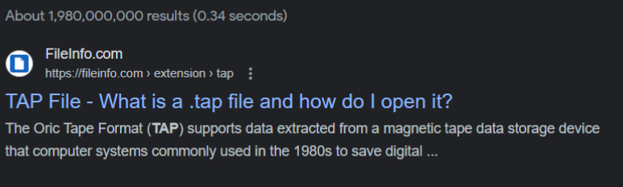
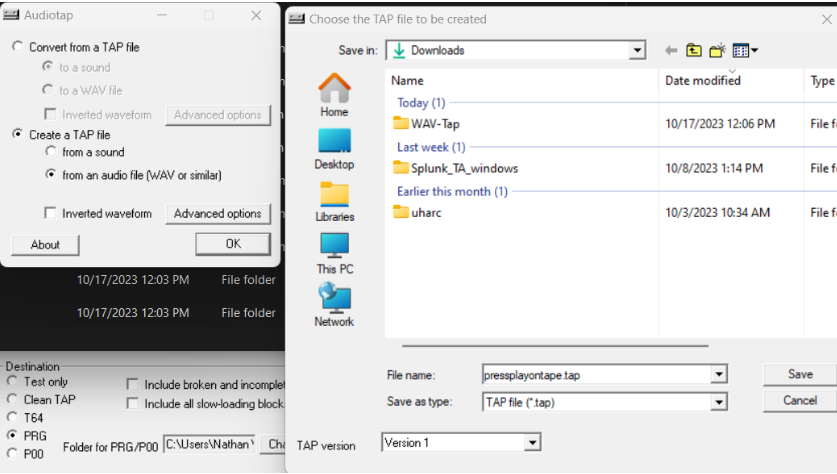
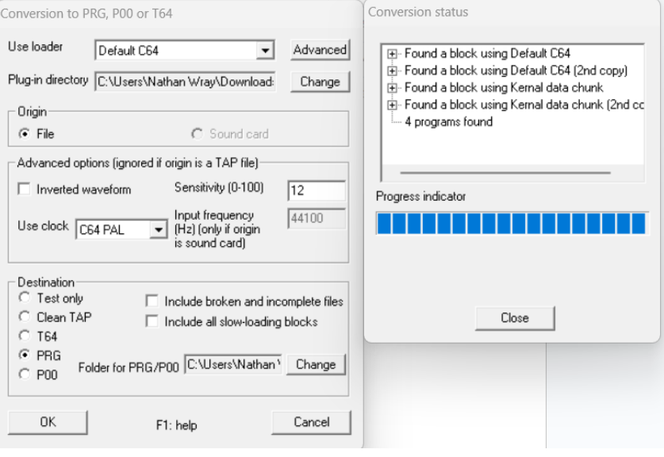
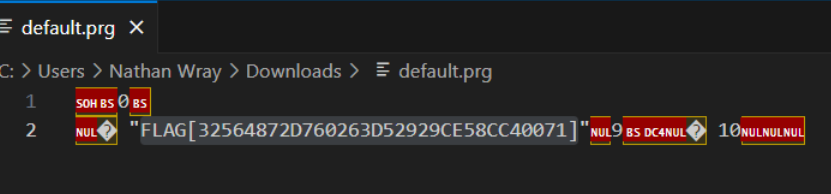

# Prompt

- I guess I didn't save this one =\

# Solution

- I wasn’t sure what to do here. Was thinking fax tones or something. Came up with nothing, then reread the hint and decided to do some research. Press Play on Tape is a geek band. “The band takes music tracks from Commodore 64 games and converts them into rock music.” - Wikipedia: 
https://en.wikipedia.org/wiki/Press_Play_On_Tape

- Then I looked up magnetic tapes and found the tap format.



- I found a tool to convert a WAV to TAP => https://wav-prg.sourceforge.io/ Open AudioTap first and convert the WAV to TAP.



- Next, convert the TAP to RPG



- Open the file in a text or hex editor to get the flag



- Convert it to the proper flag output:

```
FLAG[32564872D760263D52929CE58CC40071]
flag{32564872D760263D52929CE58CC40071}
```