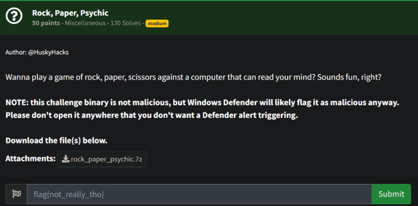
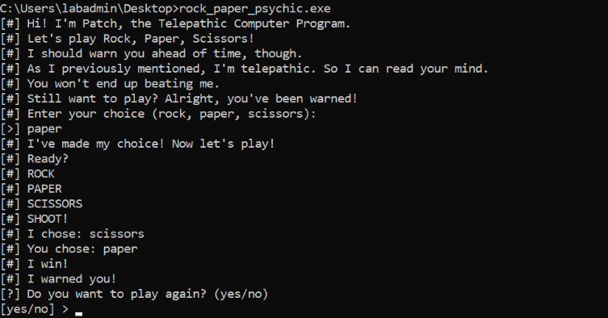
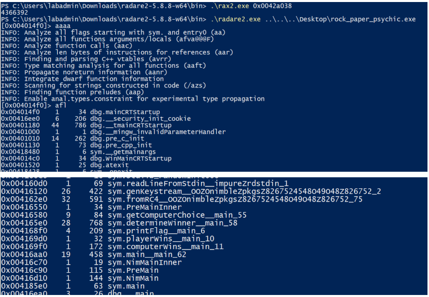
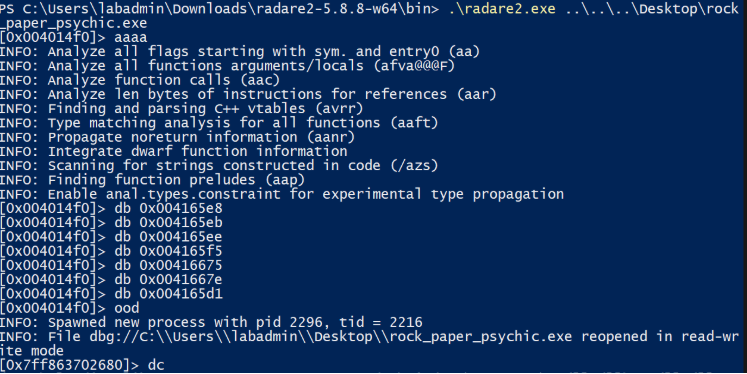
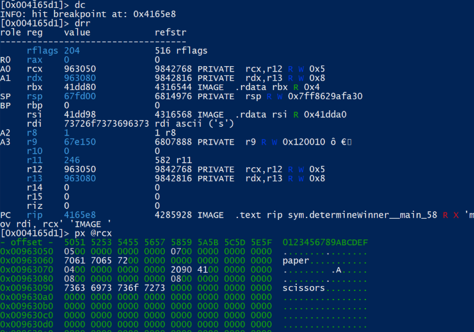
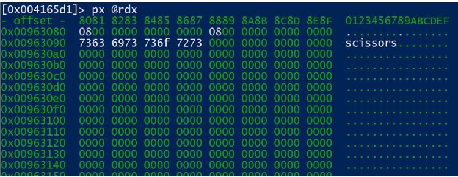
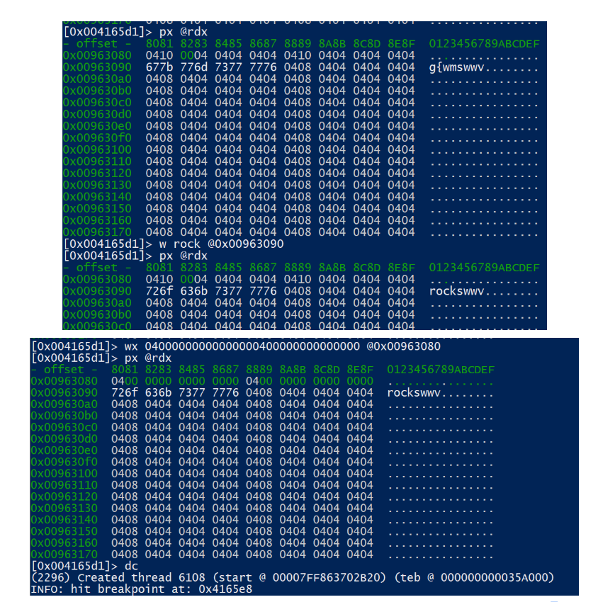
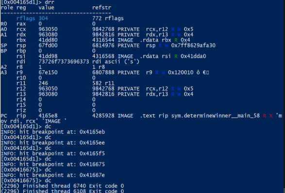
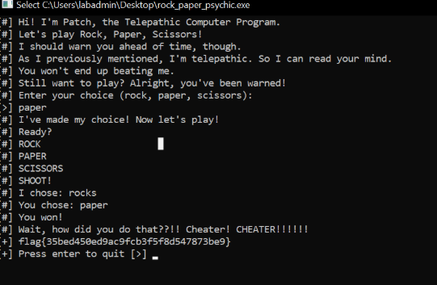
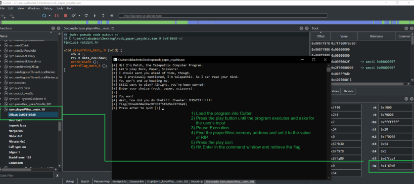

# Prompt



# Solution

- Ugh, this was annoying and I had to dust off some serious rust… I knew what I needed to do - it was a matter of actually figuring out how to do it, lol.

- I ultimately decided to install radare2 on Windows since I couldn’t get the executable to run on Kali. This is the rough process without all of the trial and error and problems along the way. Also, without the failed attempts to get other tools to work and get the answer, haha. So, as always, go Radare2! 

- This program is a Rock, Paper, Scissors game that is designed for you to intentionally lose. You can never win because it will always choose the answer that beats you.



- So we open it up in Radare2 and perform our normal starting commands:

```Powershell
.\radare2 rock_paper_psychic.exe
aaaa
afl
```



- We see some interesting functions, specifically:

```
sym.printFlag__main_6
sym.playerWins__main_10
sym.getComputerChoice__main_55
sym.determineWinner__main_58
```

- Taking a look at the Computer’s Choice, I originally set some breakpoints (below), just to take a look at the registers and see how things and where things are being stored. I also set breakpoints for determineWinner. 

```
sym.getComputerChoice__main_55:

db 0x00416580	; RCX (arg1 - user selection)
db 0x004165b8	; RAX => 5 (paper)
db 0x0041658e	; dword [rcx + 0x10], 0x6b636f72 ; 'rock' ;
db 0x00416597	; LEA (RCX, 0x0041dd60)
db 0x004165a8	; LEA (RCX, 0x0041dd40)
db 0x004165be	; (DWORD, PAER, RAX / RCX + 0x10)
db 0x004165d1	; rcx, [0x0041dd20]

sym.determineWinner__main_58

db 0x004165e8	; arg1 => rdi/rcx
db 0x004165eb	; arg2 => rsi/rdx
db 0x004165ee	; arg1 int_64   lea rcx, [0x0041dc00]
db 0x004165f5	; arg2 int_g4   mov edx, 1
db 0x00416675	; mov qword [var_20h], 0
db 0x0041667e	; var_20h, rsi

Ultimately, I didn’t need the Computer’s choice. I could just go with the determineWinner function with these breakpoints:

[0x004014f0]> db 0x004165e8
[0x004014f0]> db 0x004165eb
[0x004014f0]> db 0x004165ee
[0x004014f0]> db 0x004165f5
[0x004014f0]> db 0x00416675
[0x004014f0]> db 0x0041667e
```

- Use `ood` to execute the program:



- We use `dc` to continue until the next breakpoint. You can use ds to single step through the code as well. 



- So, here we need to not only change scissors to “rock”, but we need to change the size as well… (0800)



```
Example Output: 

[0x004165d1]> px @rdx
- offset -  8081 8283 8485 8687 8889 8A8B 8C8D 8E8F  0123456789ABCDEF
0x00963080  0800 0000 0000 0000 0800 0000 0000 0000  ................
0x00963090  7363 6973 736f 7273 0000 0000 0000 0000  scissors........

We need to change it to:

0x00963080  0400 0000 0000 0000 0400 0000 0000 0000  ................
0x00963090  726f 636b 736f 7273 0000 0000 0000 0000  rock............

We can do that with the following commands:

[0x004165d1]> wx 04000000000000000400000000000000 @0x00963080
[0x004165d1]> w rock @0x00963090
```

- Ignore the 04’s, I screwed up the command and wrote a bunch of them erroneously…



- Verify the registers with drr (size = 4) in rdx and our user input of paper (size = 5) in rcx.



- While that was running, the process was running and throughout the steps above I entered “paper” for my choice. As you can see, the program says we’re a cheater and we’re able to retrieve the flag. 



## Alternative

- Another, easier/faster solution is to use Cutter as shown below:

