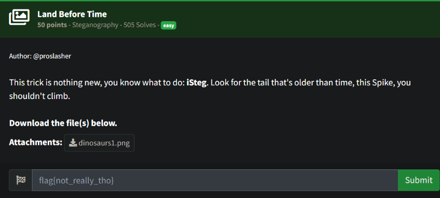
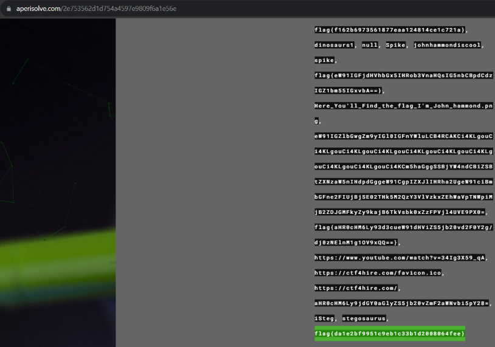

# Prompt

# Solution

-  I tried a bunch of tools and stego sites. Even tried installing a Mac emulator for Linux. Then, I found this site: https://aperisolve.com/. When I used this site, I found the flag.

