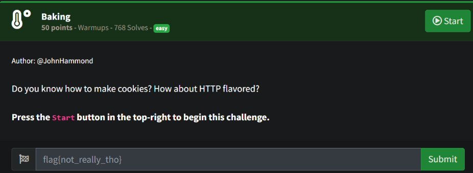
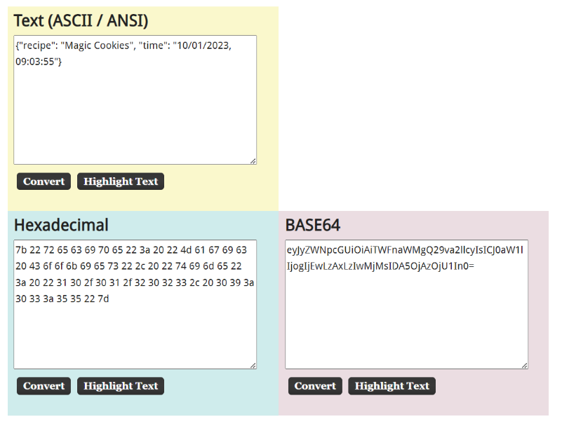
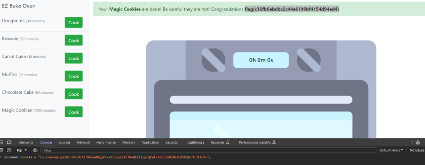

# Prompt

# Solution

- You are presented with the page below (minus the flag). When you click a button it starts a “Baking” timer and creates a cookie. The cookie has JSON with a date and time. If you modify the date and time, reconvert the JSON to Base64, and then set the cookie to the new Base64 value. So, “Magic Cookies” is probably the one with the flag - once you get the value, set it, and refresh the page, you should get the correct flag. 

