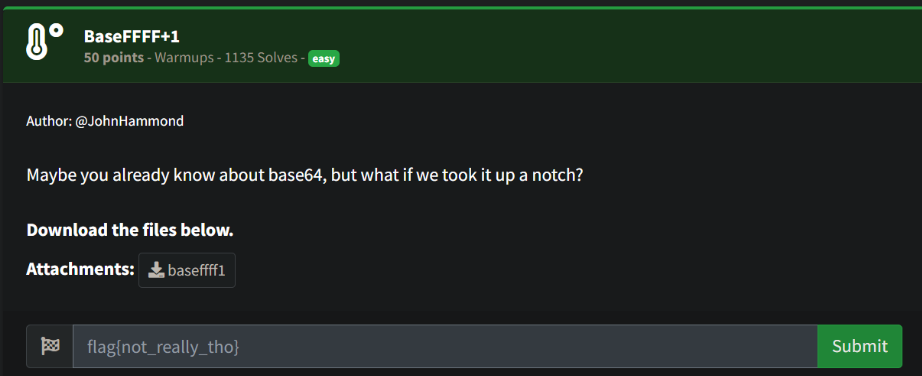
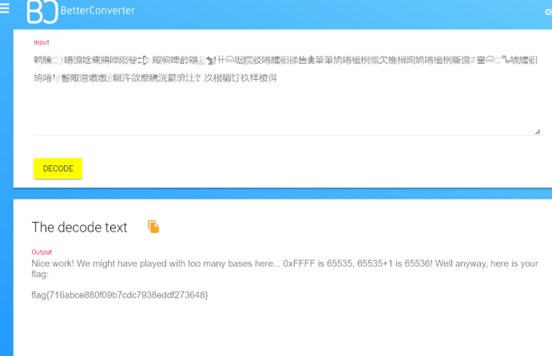

# Prompt



# Solution

- The challenge file contains the following data:

```
鹎驣𔔠𓁯噫谠啥鹭鵧啴陨驶𒄠陬驹啤鹷鵴𓈠𒁯ꔠ𐙡啹院驳啳驨驲挮售𖠰筆筆鸠啳樶栵愵欠樵樳昫鸠啳樶栵嘶谠ꍥ啬𐙡𔕹𖥡唬驨驲鸠啳𒁹𓁵鬠陬潧㸍㸍ꍦ鱡汻欱靡驣洸鬰渰汢饣汣根騸饤杦样椶𠌸
```

- Looking at the challenge name BaseFFFF+1 and the nod to Base64 in the description, I converted FFFF to Hex: 65535. If you then add ‘1’, you get 65536, so I did a search for Base65536. https://www.better-converter.com/Encoders-Decoders/Base65536-Decode

Nice work! We might have played with too many bases here... 0xFFFF is 65535, 65535+1 is 65536! Well anyway, here is your flag:

flag{716abce880f09b7cdc7938eddf273648}

