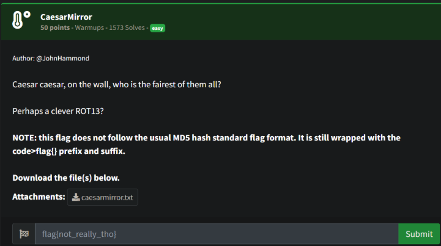
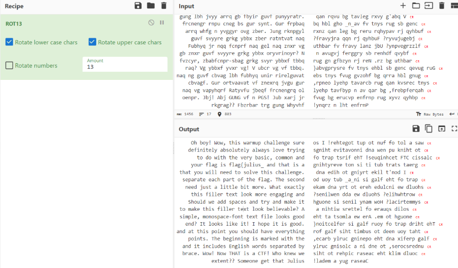
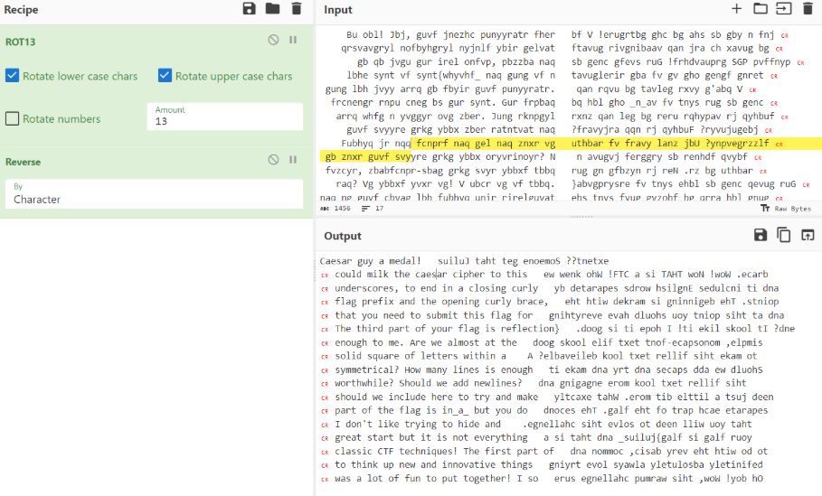

# Prompt



# Solution

- You are presented with a file that is borked - ROT13, but also mirrored. You can use CyberChef to solve this challenge.




- This was enough to solve the challenge, but I wanted to put the full thing together (below):

```
      Oh boy! Wow, this warmup challenge sure   was a lot of fun to put together! I so
    definitely absolutely always love trying   to think up new and innovative things
       to do with the very basic, common and   classic CTF techniques! The first part of
     your flag is flag{julius_ and that is a    great start but it is not everything
 that you will need to solve this challenge.    I don't like trying to hide and
  separate each part of the flag. The second   part of the flag is in_a_ but you do
   need just a little bit more. What exactly   should we include here to try and make
     this filler text look more engaging and   worthwhile? Should we add newlines?
    Should we add spaces and try and make it    symmetrical? How many lines is enough
 to make this filler text look believable? A    solid square of letters within a
 simple, monospace-font text file looks good   enough to me. Are we almost at the
   end? It looks like it! I hope it is good.   The third part of your flag is reflection}
and at this point you should have everything   that you need to submit this flag for
    points. The beginning is marked with the    flag prefix and the opening curly brace,
  and it includes English words separated by   underscores, to end in a closing curly
  brace. Wow! Now THAT is a CTF! Who knew we   could milk the caesar cipher to this
            extent?? Someone get that Julius   Caesar guy a medal!

            
                              flag{julius_in_a_reflection}
```