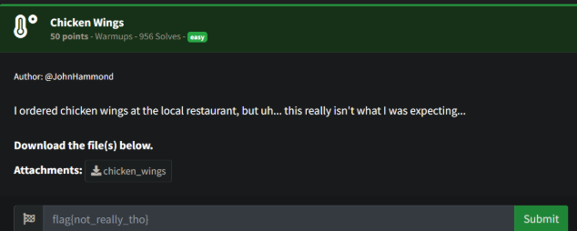
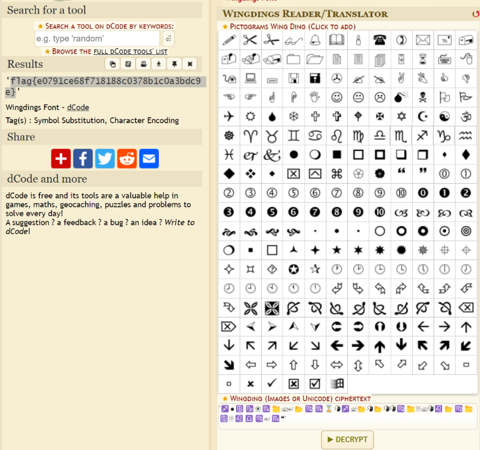

# Prompt

# Solution

- This is another stolen challenge. There is a write up online. The “chicken wings'' clue is in reference to wingdings. If you use a wingdings reader (https://www.dcode.fr/wingdings-font), you can decode the string and retrieve the flag. 

