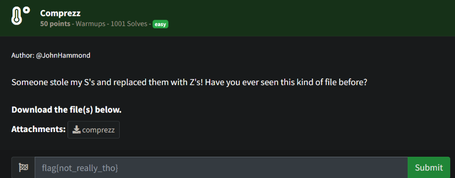

# Prompt



# Solution

- The file is compressed data, so we can use uncompress to uncompress the file and retrieve the flag.

```
file comprezz
uncompress -d comprezz
file comprezz
cat comprezz
```

