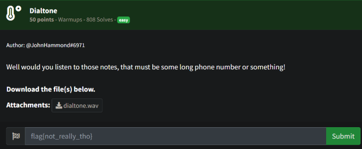
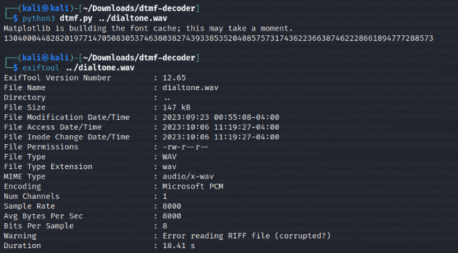
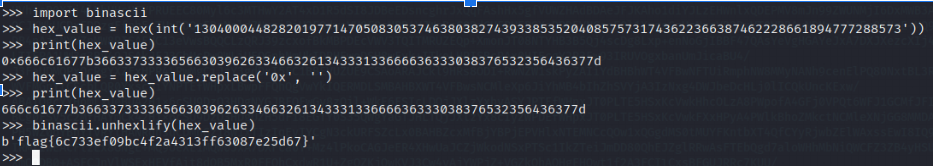

# Prompt

# Solution

- The user is presented a .wav file with dial tones from an old school phone. These are dtmf tones. Using a nifty tool, https://github.com/ribt/dtmf-decoder, you can decode the tones.  

- I tried a bunch of different things to identify these long strings of digits. Then, I found something referring to BigInts. Using some quick Python, we can get the hex of the BigInt and convert it to the flag value. 

