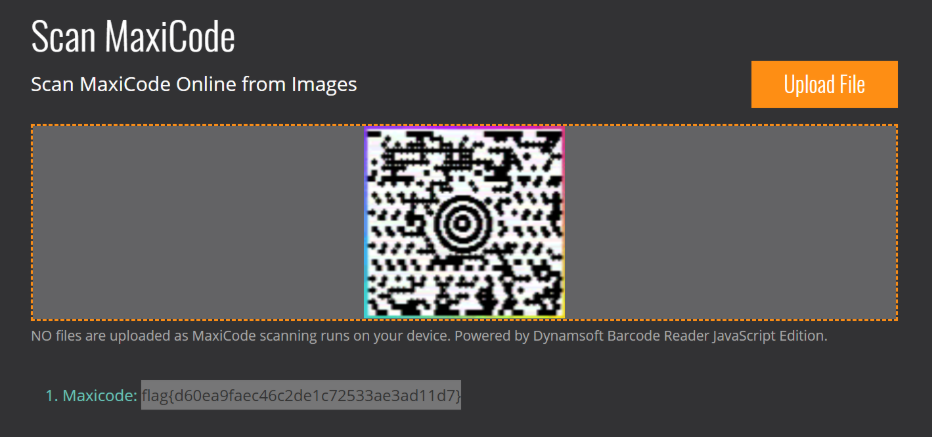

# Prompt

# Solution

- This one was fun, but annoying. I pretty much had it at one point and then started down some other rabbit hole. One thing I did was search: ‘wav "mono 44100 Hz" "ctf"’ which led to this past [CTF challenge](https://voltatech.in/blog/2024/tryhackme-nanocherryctf/#path-to-root). This then led me to SSTV. I got the code, but then saw it wasn’t a "normal" QR code and then that's where I fell down another rabbit hole.
- I wound up using this [sstv decoder](https://github.com/colaclanth/sstv) to extract the SSTV from the WAV file. 

- Now that you have this, you can actually decode it. You may recognize the bullseye from your packages. This was a tech developed by UPS called MaxiCode. I ended up using an online decoder with [Dynamsoft](https://www.dynamsoft.com/barcode-reader/barcode-types/maxicode/), but there are probably other ways. There are also online SSTV decoders such as [SSTV Decoder](https://sstv-decoder.mathieurenaud.fr/).

# Flag

- flag{d60ea9faec46c2de1c72533ae3ad11d7}