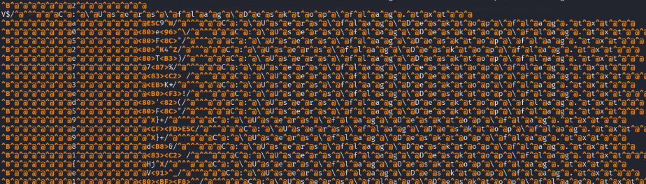
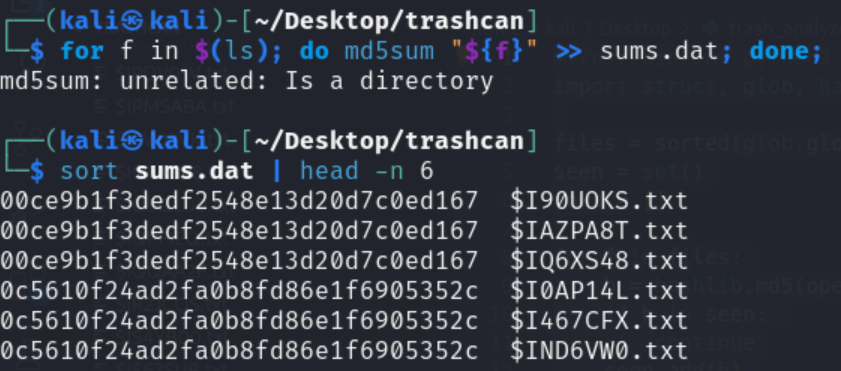

# Prompt


# Solution

## Quick Solution

- This one wasn’t hard so much as it was annoying. The Recycle Bin $I files in windows usually contain metadata whereas the $R files contain the contents. The $I files have been modified to contain the flag characters. 

- If we look at one of the files with `xxd`, we can see the character we’re after. 

```
xxd '$I01XCGF.txt'
```


- If we do some other bash fu, we can see some semblance of those chars relevance:



```
sed -e 's/C:\Users\flag\Desktop\flag.txt//g' * | less
```

- If we do an md5sum hash of the files, we can see that the files are duplicated 3 times, so we just need to order the files correctly and grab the correct letter. 

```
for f in $(ls); do md5sum "${f}" >> sums.dat; done;
sort sums.dat | head -n 6
```



```bash
python trash_analyze.py
```

```python
#!/usr/bin/env python3
import struct, glob, hashlib, collections

files = sorted(glob.glob("$I*.txt"))
seen = set()
rows = []

for f in files:
    h = hashlib.md5(open(f, "rb").read()).hexdigest()
    if h in seen: 
        continue
    seen.add(h)
    data = open(f, "rb").read(32)
    if len(data) < 24:
        continue
    char_code = struct.unpack_from("<I", data, 0x08)[0] & 0xFF
    order = struct.unpack_from("<Q", data, 0x10)[0]
    rows.append((order, char_code, f))

rows.sort(key=lambda x: x[0])
flag = ''.join(chr(c) for _, c, _ in rows if 32 <= c <= 126)
print(flag)
```
## Alternativee Solution and Explanation

- To explain the above, the Windows Recycle Bin format looks like the following:

| Offset   | Size | Data                            |
| :------- | ---: | :------------------------------ |
| 0x00     | 8    | Header/Version Info             |
| 0x08     | 8    | Original File Size              |
| 0x10     | 8    | Deletion Time (FILETIME format) |
| 0x18     | ?    | Original File Path              |

- Let’s do a breakdown of the bytes from `xxd`. 

```
00000000: 0200 0000 0000 0000 3100 0000 0000 0000  ........1.......
00000010: 0083 c220 5d08 2f00 1e00 0000 4300 3a00  ... ]./.....C.:.
00000020: 5c00 5500 7300 6500 7200 7300 5c00 6600  \.U.s.e.r.s.\.f.
00000030: 6c00 6100 6700 5c00 4400 6500 7300 6b00  l.a.g.\.D.e.s.k.
00000040: 7400 6f00 7000 5c00 6600 6c00 6100 6700  t.o.p.\.f.l.a.g.
00000050: 2e00 7400 7800 7400 0000                 	      ..t.x.t..

Header: 		    0200 0000 0000 0000		# We don’t need this for the challenge
Original File Size:	3100 0000 0000 0000  	# This is our target flag char
Deletion Time:	    0083 c220 5d08 2f00		# This is the value we need for the flag order
Original File Path: …				        # We don’t need this for the challenge
```

- Based on this data, let’s write a Python script. This is a good way to understand the structure and retrieve the flag based on what we learned from the above:

```python
#!/usr/bin/env python3

from glob import glob

# Set up the empty dict for our file data
file_data = {}
# Use glob to sort through the directory - more concise than using os
recycle_files = sorted(glob("$I*.txt"))

# Loop through the recycle bin files 
for file in recycle_files:
    with open(file, 'rb') as f:
        # We only need the first 24 bytes, really only 16 bytes
        file_contents = f.read(24)
    
    # Get the ASCII flag value from the file size field
    flag_character = file_contents[8:9].decode('ascii')
    # Get the file deletion time as an int from the deletion time 
    file_delete_time = int.from_bytes(file_contents[16:24], byteorder='little')
    # Build the dict based on the key (timestamp) and value (ASCII letter)
    file_data[file_delete_time] = flag_character

# Sort the file_data dict ascending 
sorted_items_asc = sorted(file_data.items(), key=lambda item: item[0])
sorted_dict_asc = dict(sorted_items_asc)

# Join the flag values as a string and print it out
flag = ''.join(sorted_dict_asc.values())
print(flag)
```

# Flag

- flag{1d2b2b05671ed1ee5812678850d5e329}